# GDD - Game Design Document - Módulo 1 - Inteli


## Nome do Grupo

#### Felipe Ianelli, Frederico Weiskopf, Heloisa Kadota, Manuella Lima, Matheus Almeida, Rocco Petrella, Samuel Martins, Vinicius Baumgratz


## Sumário

[1. Introdução](#c1)

[2. Visão Geral do Jogo](#c2)

[3. Game Design](#c3)

[4. Desenvolvimento do jogo](#c4)

[5. Casos de Teste](#c5)

[6. Conclusões e trabalhos futuros](#c6)

[7. Referências](#c7)

[Anexos](#c8)

<br>


# <a name="c1"></a>1. Introdução

## 1.1. Plano Estratégico do Projeto

### 1.1.1. Contexto da indústria

O mercado brasileiro de cartões é um dos principais ecossistemas financeiros do país, movimentando cerca de 4,5 trilhões de reais em 2025, valor que aumentou em 309% comparado a 2015 (Abecs, 2026), evidenciando o crescimento desses métodos de pagamento. Regulado desde 2013 pelo Banco Central, foi criada a regra para operações dos diferentes modelos de cartão (crédito, débito e pré-pago) no Brasil no modelo chamado de arranjo de pagamento, que faz a conexão “business to business to consumer” (B2B2C), conectando o consumidor, seja ele pessoa física ou jurídica, bancos emissores (ex: Itaú, Nubank, BTG Pactual…), bandeiras (ex: Mastercard, Visa, Elo…) e adquirentes (ex: Getnet, Cielo, Stone…), fazendo com que este ciclo se repita milhares de vezes a cada segundo. Nesse ecossistema, as empresas geram receita principalmente por meio de taxas cobradas sobre transações processadas, além da oferta de soluções tecnológicas, serviços de dados e segurança feitos para manter essa ligação entre as diferentes instituições financeiras. O setor vem passando por intensa transformação digital, enfrentando a concorrência que é a consolidação do PIX no mercado, além da inserção do sistema Open Finance, o qual é possível acessar diferentes contas bancárias em um mesmo lugar.

#### 1.1.1.1. Modelo de 5 Forças de Porter

A análise das 5 Forças de Porter é uma ferramenta de planejamento estratégico utilizada com o objetivo de compreender a dinâmica competitiva de um setor, analisando os principais fatores que influenciam seu posicionamento no mercado. As forças que compõem o modelo são: a ameaça de novos entrantes no mercado, ameaça de produtos ou serviços substitutos, poder de barganha - seja ele de fornecedores ou clientes - e a rivalidade entre os concorrentes existentes. Aplicando essa estrutura ao contexto da indústria de pagamento de cartões, é possível examinar a consolidação do setor, a competitividade entre as instituições e a ameaça de meios alternativos de pagamento. A análise é referida na Figura 1:

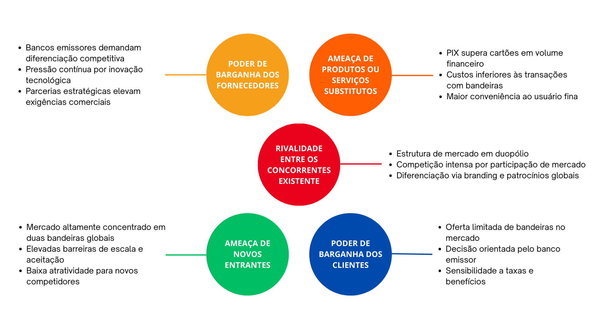

**Figura 1: Matriz das 5 forças de Porter da indústria de pagamentos de cartões**

**Fonte: Autoria Própria**

[Para melhor visualização, clique aqui](www.canva.com/design/DAHCPLGJB18/tu5wGeDA2Lq6B7v4Jf8ERg/edit?utm_content=DAHCPLGJB18&utm_campaign=designshare&utm_medium=link2&utm_source=sharebutton)


*Análise da Ameaça de Novos Entrantes: Médio*

No modelo atual da regulação brasileira, que segue o molde de Arranjo de Pagamento, foi facilitada a criação de novas bandeiras para circulação no mercado interno. Portanto é um grande desafio para qualquer empresa entrar em um mercado dominado quase totalmente por duas empresas, no caso a Visa e a Mastercard, que possuem cerca de 200 milhões de cartões em atividade no Brasil, de 212 milhões em operação (Valor Econômico, 2024). Isso mostra que entrar no mercado de bandeiras no país atualmente não parece ser o melhor investimento, visto que 94% é dominado por duas multinacionais. 

*Análise da Ameaça de Produtos ou Serviços Substitutos: Muito Alto*

Como ameaça às bandeiras, métodos de pagamento como transferências eletrônicas (TED), boletos e principalmente o PIX vem atrapalhando o funcionamento das bandeiras tendo em vista que em 2025 o PIX bateu o recorde em quantidade de dinheiro movimentado, batendo 35 trilhões de reais (G1, 2026). Em comparação aos cartões, foram apenas 4,5 trilhões de reais no mesmo período (CNN, 2026). Outro fator sobre as transferências digitais é a praticidade ao usuário para realizar o depósito de dinheiro usando apenas o aplicativo de seu banco, o que também é benéfico ao próprio banco, que não precisa pagar taxas de operação para bandeira e para o adquirente.

*Análise do Poder de Barganha dos Fornecedores: Moderado*

O maior poder exercido pelos fornecedores da Mastercard, como os serviços de armazenamento em nuvem e criptografia, manifesta-se na alteração dos preços ou no decaimento da qualidade dos serviços prestados. Esses fatores podem reduzir a eficiência da bandeira e, consequentemente, afetar seu número de clientes, estratégias e lucros. No entanto, por ser uma gigante multinacional, a Mastercard possui escala para substituir fornecedores com relativa facilidade, minimizando os efeitos de mudanças bruscas. Além disso, a empresa conta com uma ampla gama de opções no mercado, essa abundância de alternativas permite que ela dite as condições de contratação, invertendo a relação de força e aumentando seu poder de negociação frente aos provedores de serviço.

*Análise do Poder de Barganha dos Clientes: Baixo*

No mercado atual do Brasil, por conta da limitação na quantidade de bandeiras disponíveis no mercado, sendo elas apenas a Mastercard e a Visa, e o consumidor . Atualmente, grande parte dos bancos possui uma filiação exclusiva com bandeiras, como a Mastercard possui com bancos como BTG Pactual e Nubank, e a Visa possuindo a XP Investimentos, tirando bancos como Santander, Itaú e Bradesco, que possuem cartões de diversas bandeiras. Com a limitação de bandeiras, o diferencial que faz com que o cliente escolha sua bandeira, é qual banco ele identifica como mais benéfico a ele, analisando fatores como taxa de juros e outros requisitos pessoais para depois selecionar entre as bandeiras disponíveis dentro do banco para ter o cartão dela.

*Análise da Rivalidade entre os Concorrentes Existente: Alto*

A rivalidade de bandeiras no Brasil é bilateral, tendo apenas a Visa e a Mastercard brigando por uma posição de destaque no cenário, mas com a Mastercard possuindo um impacto maior no mercado brasileiro. Os dados provam a vantagem da instituição, já que possui cerca de 130 milhões de cartões ativos, cerca de 61% do mercado interno (Valor Econômico, 2024), apesar de no mercado global a Visa ter mais destaque, tendo uma receita líquida de 35 bilhões de dólares (Visa, 2024), já a Mastercard tendo cerca de 28 bilhões de dólares (Mastercard, 2024). A rivalidade também se expande para o ramo de parcerias esportivas, com a Visa sendo a patrocinadora oficial dos Jogos Olímpicos e da Copa do Mundo da FIFA, enquanto a Mastercard da Liga dos Campeões da UEFA e Roland Garros, cada um trazendo diversos benefícios aos seus clientes como pré-vendas e descontos. Isso conclui que a rivalidade entre as duas bandeiras é algo bastante intenso, mas uma disputa que fica apenas entre as duas, já que ambas duelam ano a ano para ter melhor desempenho, mas sempre ficando ou em primeiro ou segundo lugar no ranqueamento de bandeiras.


### 1.1.2. Análise SWOT

A análise SWOT é uma técnica de planejamento estratégico utilizada para analisar fatores internos e externos que podem impactar um projeto ou organização. No contexto deste trabalho, a ferramenta é aplicada para compreender o posicionamento estratégico da Mastercard no desenvolvimento do nosso jogo digital focado em educação financeira. As letras que compõem o nome da ferramenta significam strengths (forças), weaknesses (fraquezas), opportunities (oportunidades) e threats (ameaças). A matriz SWOT do projeto Mestre dos Sistemas é apresentada na Figura 2:

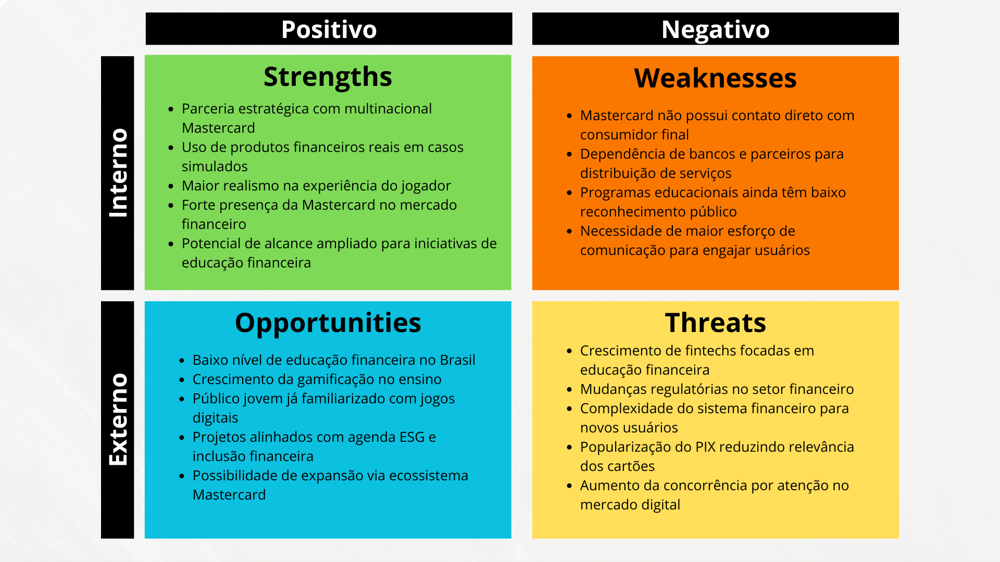

**Figura 2: Matriz de SWOT do Mestre dos Sistemas**

**Fonte: Autoria Própria**

[Para melhor visualização, clique aqui](www.canva.com/design/DAHCPLGJB18/tu5wGeDA2Lq6B7v4Jf8ERg/edit?utm_content=DAHCPLGJB18&utm_campaign=designshare&utm_medium=link2&utm_source=sharebutton)


**Strengths:**
Como força estratégica, a parceria com uma multinacional como a Mastercard pode potencializar a expansão do jogo, além de trazer maior realismo à experiência do jogador ao abordar o uso de produtos financeiros reais em situações simuladas. Além disso, a Mastercard possui uma forte influência no mercado financeira, algo que amplia o potencial do alcance de iniciativas voltadas à educação financeira.

**Weakness:**
Entre as fraquezas, o fato da Mastercard não ter contato direto com o cliente pode atrapalhar a distribuição de serviços e produtos que eles fornecem, como serviço de milhagem. Outro fator é que iniciativas em prol de maior educação financeira da população são casos que não possuem o reconhecimento que deveriam ter, algo que exige maior esforço da marca para atingir o consumidor que necessita de um produto como o jogo, para aprender a controlar seus gastos e lidar com eles.

**Opportunities:**
No ambiente externo, existem oportunidades relevantes que podem favorecer o desenvolvimento do projeto. O baixo nível de educação financeira no Brasil cria espaço para que ferramentas educacionais acessíveis e inovadoras tentem entrar no mercado para auxiliar pessoas que possuem baixo nível de educação financeira. Além disso, o público do jogo é o mesmo que consome jogos, portanto a gamificação é uma oportunidade para atingir o público alvo. Outro fator relevante é que iniciativas como essa atingem diretamente o eixo ESG, no qual projetos de educação financeira contribuem para o desenvolvimento da sociedade.

**Threats:**
Entre as ameaças externas, destaca-se o crescimento de fintechs e plataformas digitais voltadas à educação financeira. Também podem existir mudanças de regras no setor financeiro que impactem iniciativas relacionadas a produtos e serviços financeiros, em alguns casos complicando ainda mais o entendimento de pessoas que não compreendem do assunto. Além disso, a popularização de novos meios de pagamento, como o PIX, pode reduzir a centralidade das bandeiras de cartão no cotidiano financeiro dos consumidores, aumentando a competição por relevância no mercado.


### 1.1.3. Missão / Visão / Valores


Missão:
Ensinar indivíduos a tomem decisões financeiras conscientes e corretas no dia a dia, usando a gamificação como ferramenta prática para ensinar ao jogador como lidar com situações reais.

Visão:
Se tornar modelo em educação financeira gamificada para a formação de hábitos financeiros coerentes no meio do ecossistema financeiro digital. 

Valores:
Tomada de decisão guiada com informação, equilíbrio financeiro, acesso ao conhecimento como ferramenta de autonomia, segurança e responsabilidade financeira.

### 1.1.4. Proposta de Valor
De acordo com Osterwalder et al. (2014), idealizador da estratégia, o Canvas de Proposta de Valor é um método estratégico que busca a interseção entre as necessidades reais do consumidor e os diferenciais que o produto pode apresentar, assim, criando valor para o usuário. Essa ferramenta é essencial para evitar o desenvolvimento de soluções que o mercado não precisa e não valorizará, visando criar valor real ao alinhar o que o cliente quer com o que a empresa pode oferecer. O modelo se situa na convergência entre o perfil do cliente (focado na observação do comportamento do usuário) e o mapa de valor, que descreve os atributos funcionais e emocionais da solução.

Nesse sentido, a aplicação deste canvas ao projeto permite mapear como a gamificação e o storytelling de simulação de casos financeiros atuam como métodos de solução para a baixa educação financeira. Assim, o perfil identifica as tarefas cotidianas do jogador em relação a seus hábitos financeiros. E, do outro, o mapa de valor detalha como o jogo pode atuar como um "analgésico" para o endividamento e um "potencializador" de autonomia (STRATEGYZER, 2020).
Portanto, a análise a seguir (figura 3) detalha esses elementos de forma visualmente estruturada, evidenciando a coerência entre as dores do brasileiro endividado e as funcionalidades educativas da solução gamificada proposta:


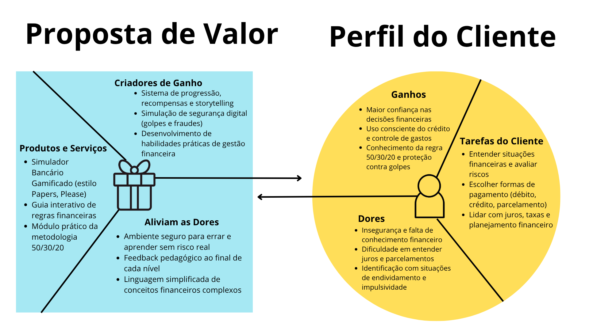

**Figura 3: Canvas de proposta de valor do projeto**

**Fonte: Autoria Própria**

[Para melhor visualização, clique aqui](www.canva.com/design/DAHCPLGJB18/tu5wGeDA2Lq6B7v4Jf8ERg/edit?utm_content=DAHCPLGJB18&utm_campaign=designshare&utm_medium=link2&utm_source=sharebutton)

**A. Perfil do Cliente**

*Tarefas do cliente (Customer Jobs)*

No jogo, o usuário assume o papel de alguém que precisa ajudar outras pessoas a tomar decisões financeiras no dia a dia. Ao longo da experiência, ele precisa:
 - analisar fichas de clientes contendo renda, histórico de crédito e comportamento de consumo;
 - selecionar formas de pagamento adequadas (débito, crédito, parcelamento com juros);
 - aplicar regras financeiras do guia diário (ex.: limite de 30% da renda comprometida);
 - identificar inconsistências ou riscos (ex.: renda incompatível com gasto);
 - orientar clientes com base nas decisões tomadas.
 
 Na prática, o jogo coloca o usuário em situações muito parecidas com a vida real, fazendo com que ele aprenda enquanto decide.


*Dores (Pains)*

Durante o jogo, o usuário se depara com dificuldades que refletem problemas reais quando o assunto é dinheiro. Entre as principais dores estão:
 - não ter conhecimento suficiente sobre finanças;
 - sentir insegurança na hora de decidir;
 - não entender bem como juros e parcelamentos funcionam;
 - identificar-se com situações delicadas, como endividamento ou uso impulsivo do cartão;
 - cometer erros nas decisões e não saber se está no caminho certo.
 
Essas dificuldades fazem parte da proposta do jogo. A ideia é justamente criar um ambiente em que o usuário possa errar, refletir e aprender, sem as consequências da vida real.

Além disso, a proposta ganha aspectos de exigência pública ao lutar contra a realidade da inadimplência no Brasil, que hoje afeta milhões (SERASA, 2026). Assim, o projeto não apenas aborda números, mas atua na dor de uma população que enfrenta barreiras educacionais que a torna uma das mais endividadas do mundo.


*Ganhos (Gains)*

Ao longo do jogo, o usuário vai ganhando mais segurança e clareza sobre como lidar com dinheiro.
Entre os principais ganhos estão:
 - Sentir-se mais confiante ao tomar decisões financeiras;
 - entender melhor como usar crédito de forma consciente;
 - aprender a controlar gastos e evitar decisões impulsivas;
 - compreender impacto de decisões no curto e longo prazo;
 - reconhecer situações de risco e saber como evitá-las;
 - ter contato com formas simples de organização financeira, como a regra 50/30/20;
 - aprender sobre segurança financeira, como evitar golpes.

No final, o usuário não sai especialista, mas sai mais preparado, com uma visão mais clara e prática sobre como lidar com o próprio dinheiro.


**B. MAPA DE VALOR**
O Mapa de Valor descreve a forma como a solução proposta foi desenhada para interceder nas necessidades do perfil do cliente, transformando funcionalidades técnicas em benefícios percebidos.

*Produtos e Serviços*
A solução materializa-se num simulador gamificado (serious game), inspirado na mecânica de gestão de documentos do jogo Papers, Please. Os principais componentes são:
 - Plataforma de simulação de hábitos financeiros: um ambiente digital em que o usuário assume o papel de analista, lidando com pedidos reais de empréstimos, cartões e investimentos.
 - Guia dinâmico explicativo: um manual interativo diário que serve de base para a tomada de decisão, convertendo normas financeiras complexas em mecânicas de jogo simplificadas.
 - Sistema de análise de crédito gamificado: Cada cliente apresenta variáveis (renda, score, histórico), exigindo validação com base em regras do dia.
 - Minigame de planejamento financeiro: uma funcionalidade integrada ao final de cada turno de jogo (1 dia in-game) que permite ao usuário aplicar esta metodologia de gestão de rendimentos em cenários práticos dentro do fluxo do jogo.


*Aliviadores de Dores (Pain Relievers)*
Para diminuir as frustrações e dificuldades do usuário, a solução atua por meio dos seguintes mecanismos:
 - Ambiente de experimentação: ao simular decisões financeiras sem o uso de capital real, o jogo reduz a ansiedade associada ao erro e ao endividamento, permitindo que o utilizador aprenda com falhas num cenário de risco zero, mas que ainda assim consegue ver suas consequências por meio da mecânica de retorno dos clientes.
 - Feedback pedagógico pós-expediente: em vez de uma interrupção punitiva, a solução oferece uma explicação detalhada das falhas ao final de cada nível. Esse aliviador de dor ataca diretamente o desconhecimento, transformando o erro numa oportunidade de aprendizagem lógica e objetiva.
 - Simplificação da complexidade financeira: a interface traduz termos complexos em diálogos com os quais o usuário se identifica e desafios contextuais, aliviando a barreira de entrada causada pela linguagem técnica bancária tradicional.


*Criadores de Ganhos (Gain Creators)*
A proposta de valor é reforçada por elementos que geram satisfação e resultados positivos para o usuário:
 - Sistema de progressão e recompensas: o uso de mecânicas de storytelling e objetivos claros incentiva o engajamento contínuo, transformando o estudo financeiro numa atividade lúdica e divertida. Além disso, a implementação de customizáveis por meio de conquistas in-game traz um novo estímulo que recompensa o usuário com cosméticos pela continuação do jogo.
 - Simulação de segurança digital: o jogo integra eventos focados na identificação de golpes e falsificações, criando um ganho de confiança para o usuário operar no ambiente bancário digital do mundo real com maior segurança.
 - Desenvolvimento de hard skills: por meio da repetição e da análise de perfis, o utilizador adquire a capacidade de planejar o seu orçamento de forma inteligente. O ganho final é a autonomia financeira, permitindo que o utilizador saia da experiência apto a gerir seus ganhos de forma lúcida.


### 1.1.5. Descrição da Solução Desenvolvida

O problema que o projeto busca solucionar está diretamente relacionado à lacuna na educação financeira no Brasil, onde grande parte da população carece de conhecimentos básicos sobre o uso consciente de crédito e a gestão de seus recursos. Essa 
deficiência se manifesta especialmente na dificuldade de aplicar conceitos técnicos — como juros, parcelamento e análise de crédito — no cotidiano. Segundo dados da ANBIMA (2023), metade dos brasileiros relata alto nível de estresse financeiro, frequentemente associado ao endividamento excessivo e ao uso inadequado de serviços como empréstimos e crédito. Esse cenário evidencia não apenas a falta de conhecimento, mas também a ausência de ferramentas eficazes e engajantes que conectem a teoria financeira à prática diária do consumidor.

Diante disso, propõe-se como solução o desenvolvimento de um jogo de simulação com narrativas dinâmicas e consequências progressivas, inspirado na mecânica de gerenciamento de documentos do jogo Papers, Please. No projeto, o jogador assume o papel de um gerente de contas recém-contratado, responsável por analisar solicitações de clientes relacionadas a crédito, empréstimos e decisões financeiras. Cada cliente apresenta informações como renda, histórico financeiro e comportamento de consumo, que devem ser avaliadas com base em critérios objetivos fornecidos pelo sistema.

O diferencial da proposta está na integração de um guia dinâmico diário, que apresenta regras e conceitos financeiros que o jogador deve aplicar diretamente nas decisões. Por exemplo, o jogador pode precisar verificar se um cliente compromete mais de 30% da renda com dívidas antes de aprovar um crédito. Decisões incorretas, como aprovar um cliente de alto risco, geram consequências dentro do jogo, como aumento da inadimplência ou queda no desempenho do jogador, tornando o aprendizado concreto e baseado em causa e efeito.

A jornada do usuário é estruturada em expedientes (dias de trabalho), com uma progressão clara de complexidade. Nos níveis iniciais, o jogador lida com decisões simples baseadas em poucas variáveis, como renda e valor solicitado. À medida que avança, novos elementos são introduzidos, como taxas de juros, parcelamentos, score de crédito e histórico financeiro. Em níveis mais avançados, o jogador enfrenta situações mais complexas, como análise de múltiplos fatores simultâneos, identificação de fraudes e tomada de decisão em cenários ambíguos. Essa progressão garante uma curva de aprendizado gradual e evita sobrecarga cognitiva.

O processo de aprendizado é reforçado por um sistema estruturado de feedback. Ao final de cada expediente, o jogo apresenta ao jogador uma análise detalhada de suas decisões, indicando quais foram corretas ou incorretas e explicando, de forma objetiva, os conceitos financeiros envolvidos. Esse sistema permite que o jogador compreenda não apenas o erro, mas também a lógica por trás da decisão correta, promovendo aprendizado ativo e contínuo.

Dessa forma, o jogo proporciona ao usuário o desenvolvimento da literacia financeira por meio da prática, permitindo que ele experimente as consequências de decisões financeiras sem riscos reais. O aprendizado é evidenciado pela melhoria no desempenho ao longo do jogo, como o aumento da taxa de acertos e a redução de erros recorrentes.

Para a Mastercard, a solução gera valor ao fortalecer seu posicionamento institucional voltado à responsabilidade social e à educação financeira. Além disso, o jogo possibilita a coleta de dados agregados sobre dificuldades recorrentes dos usuários, contribuindo para a compreensão das principais lacunas de conhecimento financeiro. Por fim, para a sociedade, o projeto contribui para a inclusão financeira e para a formação de indivíduos mais conscientes e preparados para tomar decisões financeiras, colaborando para a redução da inadimplência e para o aumento do bem-estar econômico coletivo.


### 1.1.6. Matriz de riscos

A matriz de risco é uma ferramenta que auxilia na identificação de ameaças e oportunidades que podem vir a afetar um projeto ou negócio. Ela tem como objetivo tornar uma empreitada mais segura e alocar recursos de forma que grandes problemas sejam diminuídos e pequenos problemas sejam evitados. Para isso, é usada uma matriz que relaciona linha x coluna com probabilidade e impacto no projeto. Desta forma, ficam exemplificados na figura 4 a seguir os riscos e as oportunidades que visualizamos em nosso projeto. Eles deixam claros não só o que arrisca o projeto, mas as formas como podemos evitá-los e consertá-los caso aconteça (NAPOLEÃO, 2019).

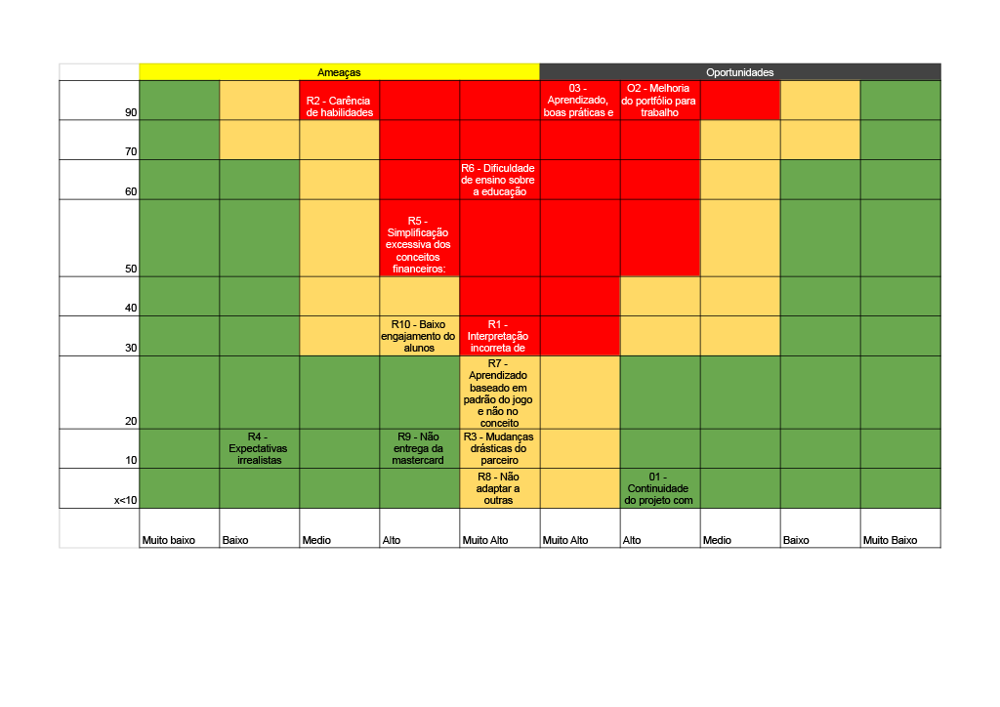

**Figura 4: Matriz de Riscos do projeto "Mestre dos Sistemas"**

**Fonte: Autoria Própria**

[Para melhor visualização, clique aqui](docs.google.com/spreadsheets/d/14kxNkHPL8LpnvBmq2bM-e5C0m4rJ1kMcE67WNg7jgZo/edit?usp=sharing)


**Riscos**

**1 - Interpretação incorreta de conceitos financeiros:** a interpretação incorreta ocorre quando o usuário compreende de forma equivocada os conceitos apresentados no jogo, como juros, parcelamento ou análise de crédito, seja por simplificação excessiva, ambiguidade nas explicações ou falhas na comunicação visual e textual do sistema.

**Impacto:** muito alto, pois compromete diretamente o principal objetivo do projeto, que é o ensino de educação financeira. Caso o usuário aprenda de forma errada, o jogo deixa de cumprir sua função educativa e pode até reforçar comportamentos financeiros prejudiciais, como a aceitação de condições desfavoráveis de crédito ou a má interpretação de riscos.

**Probabilidade:** cerca de 30%, uma vez que conceitos financeiros podem ser complexos e, ao serem adaptados para mecânicas de jogo, correm o risco de perder precisão ou clareza, especialmente para usuários sem conhecimento prévio.

**Plano de ação:** garantir que todos os conceitos utilizados no jogo sejam validados com fontes confiáveis; implementar feedbacks explicativos obrigatórios ao final de cada decisão; testar o jogo com usuários reais para identificar pontos de confusão; e revisar continuamente a clareza das instruções e do guia dinâmico.

**2 - Carência de habilidades:** a falta de habilidades é também um problema que afeta grandemente o projeto, em especial para nós, que somos alunos do primeiro ano e, muitas vezes, estamos tendo contato pela primeira vez com vários dos elementos necessários para a criação de um jogo e de um projeto cooperativo com tantas pessoas, que busca entregar um resultado real. Seja a falta de conhecimento em programação, na criação de documents/assets, dificuldades na elaboração de documentações mais complexas ou até mesmo no trabalho em equipe, todos são elementos que podem vir a afetar a progressão e o ritmo em que o projeto se desenvolve.

**Impacto:** mediano, pois, apesar de muitos alunos apresentarem dificuldades em determinadas áreas, existem outros colegas que podem suprir ou ensinar meios e formas que contribuam para a criação de resultados no projeto.

**Probabilidade:** 90%, pois é muito difícil encontrar um time que seja especialista em todos os âmbitos do projeto ao mesmo tempo, seja em programação, design ou documentação.

**Plano de ação:** existem diversas formas de contornar essas dificuldades técnicas, como pedir ajuda a colegas, professores e monitores, buscar conteúdos na internet e absorver os conteúdos apresentados em aula. O contato com um conteúdo novo é sempre desafiador, mas a falta de conhecimento é algo que pode ser suprido com o passar do tempo.

**3 - Mudanças drásticas do parceiro:** requerimentos específicos do parceiro podem vir a ser uma ameaça que regride todo o progresso do projeto. O formato do jogo pode não ser do agrado do parceiro, ou a forma como está sendo desenvolvido, o design, assim como qualquer outro elemento, seja grande ou pequeno, pode exigir um retrocesso para seguir por um caminho mais alinhado às expectativas do parceiro.

**Impacto:** muito alto, pois toda a linha de pensamento do projeto terá de ser recriada a fim de se alinhar melhor com as expectativas do parceiro. Entretanto, são apenas 10 semanas para a realização do projeto, e perder de uma a duas semanas coloca em risco tanto a entrega quanto a qualidade final.

**Probabilidade:** 15%, pois, apesar de ser um risco real, suas chances de ocorrência não são tão altas, visto que já no kickoff existe um alinhamento claro sobre o que o parceiro deseja e as métricas utilizadas para avaliar o projeto. Além disso, há reviews e feedbacks a cada 2 semanas durante a sprint review.

**Plano de ação:** aceitar os feedbacks do parceiro e ajustar o projeto conforme necessário, evitando qualquer disparidade ou inconsistência em relação ao que ele espera ao final.

**4 - Expectativas irrealistas:** um dos problemas a serem enfrentados não é apenas o alinhamento com o parceiro quanto à forma como ele deseja o projeto, mas também a magnitude das expectativas que ele pode ter, como, por exemplo, expectativas que ultrapassem o escopo que alunos do primeiro ano, em seus três primeiros meses de aula, conseguem atingir.

**Impacto:** baixo, pois, mesmo que o parceiro tenha expectativas acima do escopo de habilidades dos alunos do primeiro ano, os docentes de programação e orientadores, que estão sempre presentes nas sprint reviews, explicam e alinham que não é possível esperar uma magnitude tão elevada.

**Probabilidade:** 12%, pois os parceiros da Mastercard são bastante realistas em relação ao que esperam do projeto e ao público que desejam atingir.

**Plano de ação:** caso não haja apoio imediato dos docentes, o ideal é explicar ao parceiro, de forma simples e objetiva, que em determinados aspectos o projeto não será tão complexo e que certas metas não poderão ser atingidas.

**5 - Simplificação excessiva dos conceitos financeiros:** a simplificação excessiva ocorre quando, ao adaptar conteúdos técnicos para o formato de jogo, os conceitos são reduzidos a ponto de perderem sua complexidade essencial, gerando uma compreensão superficial por parte do usuário.

**Impacto:** alto, pois pode levar o jogador a acreditar que domina determinado conceito quando, na realidade, compreende apenas uma versão incompleta ou distorcida, prejudicando a aplicação desse conhecimento fora do jogo.

**Probabilidade:** cerca de 50%, visto que existe uma tendência natural de simplificar sistemas complexos para torná-los jogáveis e acessíveis, especialmente em projetos educacionais gamificados.

**Plano de ação:** equilibrar jogabilidade e fidelidade conceitual, introduzindo os conteúdos de forma progressiva; aumentar gradualmente a complexidade dos cenários; e revisar constantemente se as mecânicas refletem adequadamente situações reais, evitando reduções excessivas.

**6 - Dificuldade de ensino sobre a educação financeira**: devido ao tema não ser algo que as pessoas costumam buscar ativamente em seu tempo livre, por ser considerado chato ou entediante, ou por preferirem realizar outras atividades não relacionadas à educação financeira.

*Impacto:* muito alto, pois a falta de engajamento dos usuários seria equivalente a ter desenvolvido o jogo sem propósito, tornando este um dos pontos mais críticos a serem evitados.

*Probabilidade:* 60%, devido à forma como a educação financeira ainda não é amplamente difundida na sociedade brasileira. Assim, muitos dos jogadores podem não chegar a concluir o jogo.

*Plano de ação:* desenvolver um jogo dinâmico que estimule o engajamento dos jogadores, além de incluir recompensas que incentivem a continuidade.

**7 - Aprendizado baseado em padrão do jogo e não no conceito:** esse risco ocorre quando o jogador passa a tomar decisões corretas apenas por reconhecer padrões repetitivos do sistema, sem compreender os conceitos financeiros por trás dessas decisões.

**Impacto:** muito alto, pois o usuário pode apresentar bom desempenho dentro do jogo, mas sem adquirir conhecimento real aplicável fora dele, comprometendo completamente o objetivo educacional do projeto.

**Probabilidade:** cerca de 25%, especialmente em jogos com mecânicas repetitivas ou padrões previsíveis, onde o jogador pode “decorar” respostas ao invés de raciocinar sobre elas.

**Plano de ação:** variar os cenários e dados apresentados aos jogadores; evitar padrões fixos nas respostas corretas; introduzir eventos inesperados e múltiplas variáveis nas decisões; e reforçar o aprendizado por meio de explicações conceituais nos feedbacks, incentivando a compreensão em vez da memorização.

**8 - Não conseguir adaptar o projeto a outras plataformas:** conforme solicitado pelo parceiro, é necessário desenvolver o jogo para mobile; entretanto, o projeto foi inicialmente iniciado para web, o que exige uma adaptação posterior por meio de ferramentas específicas.

**Impacto:** muito alto, pois o não atendimento aos requisitos do parceiro pode resultar no fracasso do projeto e na não aceitação da entrega final.

**Probabilidade:** 2% a 5%, visto que existem diversas ferramentas que possibilitam essa adaptação, inclusive algumas nativas no Phaser.

**Plano de ação:** antecipar o processo de adaptação para mobile, evitando imprevistos próximos ao prazo final de entrega.

**9 - Não entrega do Mastercard Surpreenda:** a não disponibilização do cupom do Mastercard Surpreenda pode prejudicar o engajamento dos jogadores, uma vez que esse benefício funcionaria como incentivo para um melhor desempenho no jogo. Sua ausência pode reduzir o interesse dos usuários em aprender.

**Impacto:** alto, pois impacta diretamente o engajamento dos jogadores e a forma como interagem com o jogo e com o conteúdo educativo.

**Probabilidade:** 12%, sendo uma chance relativamente baixa, visto que já existe alinhamento com os representantes da Mastercard.

**Plano de ação:** realizar acompanhamento e cobranças de forma clara e respeitosa junto aos representantes da Mastercard para garantir a implementação do benefício.

**10 - Baixo engajamento dos alunos:** devido ao fato de os alunos do primeiro ano estarem frequentemente engajados em atividades extracurriculares, eventos e outras oportunidades oferecidas pela faculdade, pode ocorrer de não priorizarem adequadamente o projeto e o momento de desenvolvimento, o que leva ao atraso das atividades relacionadas ao projeto.

**Impacto:** alto, pois o atraso de um membro pode impactar diretamente o andamento das atividades de outros integrantes, seja pela necessidade de redistribuição de tarefas ou pela realização de múltiplos reviews devido à baixa qualidade das entregas.

**Probabilidade:** 40%, já que muitos alunos subestimam o tempo disponível e a quantidade de tarefas que conseguem realizar nesse período, aumentando a chance desse problema ocorrer.

**Plano de ação:** alinhar com todos os membros que o projeto possui prioridade mínima obrigatória, mesmo diante de outras atividades, deixando explícito o impacto coletivo causado pelo atraso individual.

**OPORTUNIDADES**
**1 - Continuidade do projeto com a Mastercard:** com a qualidade do projeto, é possível que alguns grupos ou indivíduos possam ser chamados para trabalhar no projeto em conjunto com a Mastercard em uma data futura.

**Impacto:** muito alto, seria uma grande oportunidade trabalhar em uma empresa tão grande e tão renomada como a Mastercard.

**Probabilidade:** 5% não foi dada nenhum tipo de expectativa do tipo, além de que, como os representantes que participam das sprints reviews mudam quase que de forma semanal, existe uma dificuldade de criar uma relação de confiança individual com os representantes.

**2 - Melhoria do portfólio para trabalho:** como o projeto é para uma empresa grande e algo muito inusitado no primeiro ano de faculdade. Seria algo que ajudaria muito a ter no currículo e no LinkedIn.

**Impacto:** muito alto, entre um aluno do mesmo curso e período, temos uma vantagem em relação a pessoas que buscam talentos por já ter um projeto feito e entregue à Mastercard.

**Probabilidade:** 95% a única forma de não termos este projeto em nosso currículo seria se nosso grupo não entregasse o projeto, e isso é algo com uma possibilidade muito baixa de acontecer.

**3 - Aprendizado sobre boas práticas e soft skills:** como temos um projeto tão cedo na faculdade, é muito vantajoso nós aprendermos sobre como trabalhar em projetos tão cedo e de forma mais eficiente com várias métricas.

**Impacto:** muito alto, para o currículo, é outro elemento muito importante, pois o recrutador saber que você sabe trabalhar em equipe e é eficiente de forma que consegue entregar o projeto é um asset grande.

**Probabilidade:** 97%, mesmo que não entregue o projeto, é quase impossível você não interagir com seus colegas de grupo e ver sobre os conteúdos da faculdade, logo, você inevitavelmente vai aprender algo sobre gerenciamento de projetos.


### 1.1.7. Objetivos, Metas e Indicadores

A definição de Objetivos, Metas e Indicadores tem como missão a organização e o alinhamento do que deve ser feito para que o projeto alcance o que foi proposto. Para isso, utilizaremos a metodologia de metas SMART.
A metodologia SMART serve para que as metas sejam mais claras e bem definidas, começando pelas específicas: que determinam o que será feito e como será feito; já as mensuráveis medem o progresso e a efetivação do projeto; as alcançáveis avaliam se a métrica é realmente útil para o projeto e se pode ser atingida; relevante: deve estar alinhada aos princípios e valores da empresa; temporal: define se o objetivo é realizável dentro de um determinado período de tempo (Thiago Rocha, 2025)

Dessa forma, para introduzirmos nossos objetivos, iremos começar utilizando outro método de metas, também chamado de OKR, que é a sigla para Objectives and Key Results, no qual Objectives são as metas que pretendemos alcançar. Normalmente, essa metodologia é utilizada para períodos de 3 meses ou até mesmo um ano, a depender do tamanho da empresa; porém, a adaptamos para duas sprints, sendo esta a quarta e a última de review. Já os Key Results são as métricas que utilizaremos para validar se o objetivo foi alcançado. (Suellen Hoffriman, 2020)


**Objetivo 1** - Completar o MVP até o fim da sprint 4, com todas as funcionalidades como conquistas, vários finais, mini jogos e personalização dos sprites integrados e funcionando perfeitamente.

**Key Results:**
- 100% dos artefatos de GDD finalizados e aprovados até 20/03
- 100% dos artefatos revisados e validados pelo time até 24/03
- Aumentar a produtividade de atividades para pelo menos 3 a 4 pequenas ou 2 médias por dia.
- Implementar 100% das funcionalidades do MVP (conquistas, finais, mini games, personalização)

**Objetivo 2** -  Melhorar a qualidade da jogabilidade e garantir uma apresentação sólida e profissional para a sprint 5.

**Key Results**
- 100% dos feedbacks críticos e importantes implementados até 10/04
- Apresentação final validada pelo grupo e pelos orientadores com pelo menos nota 9/10 em clareza, organização e estética até 03/04
- Funcionalidade do jogo com duas rodadas de teste entre devs internos e usuários externos com nota de satisfação de pelo menos 8/10.

 Agora iremos estruturar os objetivos com a metodologia SMART.

**Objetivo 1:** Ter todas as configurações necessárias para o jogo ser completamente funcional até o dia 26 de março, a tempo da apresentação do MVP

- **S. Específico:** Garantir que o código do jogo esteja em um estado completo e funcional até a apresentação do MVP, incluindo todas as mecânicas principais, fluxo de jogo contínuo e interface básica operante.

- **M. Mensurável:** O progresso será medido por meio da verificação de uma lista de requisitos definidos previamente, contemplando funcionalidades essenciais implementadas, ausência de bugs críticos e execução completa do jogo sem interrupções.

- **A. Alcançáveis:** A responsabilidade por esse objetivo é compartilhada entre todos os membros da equipe, com cada integrante contribuindo com suas respectivas entregas no desenvolvimento do projeto.

- **R. Relevante:** A finalização do código base do jogo é fundamental para possibilitar o avanço para melhorias adicionais, implementação de diferenciais e correção de eventuais falhas identificadas posteriormente.

- **T. Temporais:** O objetivo deverá ser concluído até o dia 26 de março, garantindo tempo hábil para validação interna antes da apresentação do MVP no dia 27.


**Objetivo 2:** Melhorar a qualidade da jogabilidade e garantir uma apresentação sólida e profissional para a Sprint 5

- **S. Específico:** Elevar a qualidade da jogabilidade do projeto, tornando a experiência do usuário mais fluida, compreensível e engajante, além de estruturar uma apresentação clara, organizada e profissional para a Sprint 5.

- **M. Factível:** O progresso será avaliado por meio da redução de bugs críticos e inconsistências na jogabilidade, além da coleta de feedback interno da equipe e validação de um roteiro estruturado para a apresentação.

- **A. Atribuível:** A responsabilidade por esse objetivo também é compartilhada entre todos os membros da equipe, envolvendo tanto o aprimoramento técnico do jogo quanto a preparação da apresentação.

- **R. Relevante:** A melhoria da jogabilidade aumenta o engajamento do usuário e a qualidade da experiência, enquanto uma apresentação bem estruturada amplia as chances de aceitação e reconhecimento por parte do parceiro avaliador.

- **T. Realizável:** O objetivo deverá ser alcançado até o final da Sprint 5, assegurando que tanto o jogo quanto a apresentação estejam devidamente preparados para avaliação.


## 1.2. Requisitos do projeto

Requisitos

Requisitos são exigências obrigatórias para a atender objetivos ou cumprir funções específicas, sendo formados por características ou capacidades. Operando como um guia dos elementos necessários do projeto.

A seguir temos os requisitos de nosso projeto

| **Requisito** | **Descrição** |
|---|---|
| **1** | Adicionar botões funcionais, como o de jogar, ajuda e opções: <br> - Fazer o design dos botões |
| **2** | Adicionar guia de informações: <br> - Elaborar o visual do guia <br> - Elaborar material didático para cartão de crédito, débito e pré-pago |
| **3** | Implementar o dossiê: <br> - Desenhar os clientes <br> - Criar a ficha que junta todas as informações do cliente |
| **4** | Implementar as perguntas: <br> - Elaborar as perguntas dos clientes ao jogador |
| **5** | Adicionar alerta de erro de escolha: <br> - Implementar no código um aviso para falha quando o jogador errar as questões da pergunta |
| **6** | Adicionar calculadora básica para auxiliar nos cálculos do jogo: <br> - Criar o visual da calculadora <br> - Implementar uma tela de overlay quando clicar na calculadora com a função de somar, diminuir, multiplicar e dividir |
| **7** | Ambientar cada fase como um dia diferente do trabalho: <br> - Idealizar como funcionam os dias <br> - Criar um aumento de dificuldade a cada dia com perguntas mais complexas |
| **8** | Formatar para web e mobile: <br> - Adicionar o jogo no GitLab Pages |
| **9** | Implementar tutorial: <br> - Elaborar como vai funcionar o tutorial do jogo <br> - Criar o visual da chefe que irá apresentar o tutorial |
| **10** | Implementar as dinâmicas de pergunta: <br> - Elaborar sistema de recompensa para cada pergunta acertada |

**Quadro 1: Requisitos do Jogo**

**Fonte: Autoria Própria**

## 1.3. Público-alvo do Projeto 

De maneira geral, o público-alvo do jogo “Mestre dos Sistemas” se concentra em jovens adultos recém-inseridos no mercado de consumo. À vista disso, se torna de relevância mencionar que, de acordo com o Dados do Serviço de Proteção ao Crédito (SPC, 2022), 46% dos brasileiros com idade entre 25 e 29 anos estão inadimplentes e, além disso, outro dado, da mesma fonte, revela que 75% dos jovens com idade entre 18 e 30 anos não fazem controle dos gastos. Portanto, mostra-se a necessidade de concentrar os esforços para que a mencionada geração Z saiba cuidar de suas economias de maneira mais eficiente.

Além disso, o foco na Geração Z mostra-se eficiente, visto que um levantamento realizado pela Serasa identifica os obstáculos financeiros enfrentados por essa geração e os relaciona ao elevado índice de endividamento presente nessa parcela da sociedade. Por outro lado, segundo a própria instituição, “essa geração tem uma vantagem: a disposição para aprender, se adaptar e mudar hábitos. Quando toma consciência de seus problemas, esse grupo consegue usar a tecnologia a seu favor, evitando erros comuns e desenvolvendo estratégias para economizar, investir e melhorar a saúde financeira.”

Dessa forma, tal afirmação evidencia a importância da utilização de recursos gamificados como ferramenta para combater a falta de educação financeira que leva muitos jovens a iniciarem sua vida financeira de maneira inadequada, o que pode resultar em prejuízos no futuro.


# <a name="c2"></a>2. Visão Geral do Jogo 

## 2.1. Objetivos do Jogo 

O objetivo do jogo é ensinar os jogadores a entenderem os termos de finanças (crédito, débito e pré-pagos) por meio do jogo,  dando ao jogador as ferramentas necessárias para resolver os problemas propostos pelos clientes, como consequência, seu conhecimento na área simultaneamente.
O meio de passar de fase é atender um mínimo de clientes diariamente, aumentando a cada nível. O não cumprimento do mínimo de clientes resultará em o jogador ter de refazer a fase. Os clientes trazem os problemas e o jogador deve fornecer o conselho financeiro ideal a seus clientes para avançar no jogo.


## 2.2. Características do Jogo 

### 2.2.1. Gênero do Jogo 

Em relação ao gênero, “Mestre dos Sistemas” enquadra-se nas categorias point-and-click e simulação. Jogos do tipo point-and-click são aqueles em que o jogador controla as ações do personagem por meio da interação direta com elementos da tela. Ademais, jogos de simulação buscam reproduzir atividades ou sistemas do mundo real, priorizando a imersão e a identificação do jogador com as situações apresentadas.
 

### 2.2.2. Plataforma do Jogo 

O desenvolvimento de Mestre dos Sistemas prioriza a acessibilidade universal, buscando maximizar o alcance do projeto. A plataforma principal será uma aplicação web voltada para desktop, compatível com todos os navegadores modernos e baseada em tecnologias leves de renderização.

De forma complementar, o jogo contará com uma versão mobile responsiva, projetada para interação por toque e adaptação a telas de menor dimensão.

### 2.2.3. Número de jogadores 

A imersão “Mestre dos Sistemas” foi concebida como uma experiência para um único jogador. Nela, o usuário assume o papel de um consultor bancário que deve atender clientes e resolver problemas. Ao longo da jornada, o jogador aprende sobre educação financeira e ganha medalhas de conquista, aumentando o engajamento com a experiência.


### 2.2.4. Títulos semelhantes e inspirações 

O jogo Papers, Please foi utilizado como principal referência conceitual, especialmente por seu modelo de simulação em pixel art no qual o jogador analisa informações e toma decisões para cumprir um “expediente”. Esse formato inspira uma proposta centrada na autonomia, na análise crítica e na resolução de problemas como mecânicas centrais da experiência.

Como referência para sistemas de personalização e progressão estética, considera-se Papa's Pizzeria, que apresenta um modelo de loja voltado à customização do ambiente. A partir dessa inspiração, propõe-se a implementação de um sistema de decoração que permita ao jogador modificar o espaço do jogo, tornando-o mais dinâmico e adaptável às preferências individuais.

No que se refere à integração de conteúdo educacional à mecânica principal, toma-se como base Financial Football, que aborda conceitos financeiros por meio de analogias com jogadas esportivas. A partir dessa abordagem, estrutura-se a proposta de inserir clientes que apresentem situações-problema relacionadas aos tópicos educacionais trabalhados, promovendo a aprendizagem aplicada dentro da dinâmica do jogo.

### 2.2.5. Tempo estimado de jogo 

Estima-se que o jogo pode ser concluído em média em 30 minutos. Entretanto, entende-se que existem diferentes agilidades durante o aprendizado, tornando uma possibilidade de variação no tempo real.

# <a name="c3"></a>3. Game Design 

## 3.1. Enredo do Jogo 

Em “Mestre dos Sistemas”, o jogador assume o papel de um gerente de finanças que trabalha auxiliando clientes com dúvidas e problemas relacionados a crédito, débito, cartões pré-pagos e hábitos financeiros. Ao longo dos dias, seu objetivo é atender clientes, oferecendo orientações corretas sobre esses temas. Cada dia representa um novo ciclo de atendimentos, exigindo que o jogador aplique seus conhecimentos para cumprir as metas estabelecidas. Caso o jogador faça decisões que prejudiquem o cliente, ele voltará em novas condições que condizem com a sua situação atual.


## 3.2. Personagens 

### 3.2.1. Controláveis

O personagem controlável é um gerente de conta, o nome dado ao personagem é escolhido pelo jogador na tela de início, onde também seleciona o gênero. O protagonista não conta com um design definido, pois o jogo se passaria em primeira pessoa. A escolha disso se deu pelo fato de que um personagem em primeira pessoa ativa a empatia imediata do jogador, o que o faria imaginar a narrativa como sua própria experiência, enraizando os aprendizados. Além disso, o protagonista seria um colaborador ainda inexperiente, assim, possibilitando ao jogador aprender paralelamente ao personagem.

### 3.2.2. Non-Playable Characters (NPCs)

Os NPCs do jogo são os clientes, que possuem problemas financeiros que o protagonista irá resolver. Os clientes necessitam de ajuda e de conselhos financeiros, aos quais o jogador aprenderá a responder ao longo do jogo. Assim, as Figuras 8, 9, 10 e 11 são exemplos de personagens não jogáveis (NPCs) do jogo “Mestre dos Sistemas”.


**Figura 8: Personagem Cledson**

**Fonte: Autoria Própria com a ferramenta Stardew Valley Character Portrait maker**


**Figura 9: Personagem Fernanda**

**Fonte: Autoria Própria com a ferramenta Stardew Valley Character Portrait maker**


**Figura 10: Personagem Lucas**

**Fonte: Autoria Própria com a ferramenta Stardew Valley Character Portrait maker**


**Figura 11: Personagem Fabiana**

**Fonte: Autoria Própria com a ferramenta Stardew Valley Character Portrait maker**


**Figura 12: Personagem Laíza**

**Fonte: Autoria Própria com a ferramenta Stardew Valley Character Portrait maker**


**Figura 13: Personagem Marcelo**

**Fonte: Autoria Própria com a ferramenta Stardew Valley Character Portrait maker**


**Figura 14: Personagem Roberto**

**Fonte: Autoria Própria com a ferramenta Stardew Valley Character Portrait maker**


**Figura 15: Personagem Samantha**

**Fonte: Autoria Própria com a ferramenta Stardew Valley Character Portrait maker**


**Figura 16: Personagem Vanessa**

**Fonte: Autoria Própria com a ferramenta Stardew Valley Character Portrait maker**


**Figura 17: Personagem Heitor**

**Fonte: Autoria Própria com a ferramenta Stardew Valley Character Portrait maker**


### 3.2.3. Diversidade e Representatividade dos Personagens

O jogo “Mestre dos Sistemas” tem como um de seus principais objetivos não apenas a educação financeira, mas também a promoção da representatividade. O projeto visa à diversidade tanto pedagógica quanto social, buscando incluir diferentes perfis da sociedade brasileira para fortalecer a conexão com o público-alvo.

O sistema de inclusão pedagógica se dá pela integração de situações baseadas em realidades concretas, com personagens que possuem rendas variando entre R$ 2.277 e R$ 11.000, exercendo profissões como caixa de supermercado, professor, médica, administradora e estagiário. Essas variações permitem representar diferentes classes sociais, níveis de escolaridade e contextos financeiros, incluindo situações de endividamento, consumo impulsivo e planejamento financeiro.

O jogo é direcionado a jovens adultos brasileiros em início de vida financeira, que enfrentam desafios como controle de gastos, uso consciente de crédito e tomada de decisão econômica. A diversidade também se estende a aspectos sociais, como gênero, etnia e contexto familiar, promovendo maior identificação entre jogador e personagem.

Prezando pela representatividade, o jogo se estrutura a partir da interação direta com NPCs, onde cada personagem está associado a uma mecânica específica de aprendizagem, como análise de crédito, controle de orçamento e avaliação de risco. Dessa forma, a identificação com o personagem é utilizada como ferramenta para engajamento e aprendizado prático, permitindo que o jogador compreenda conceitos financeiros por meio de decisões dentro do jogo.

Nosso NPCs se encaixam em diversas minorias tanto de cunho pedagógico quanto social:

1. Cledson Almeida dos Santos (Figura 8): Jovem profissional atuante no setor público de educação, com renda estável e vínculo empregatício formal. Seu perfil é marcado pela limitada reserva financeira e baixa resiliência a imprevistos, refletindo os desafios típicos de quem depende exclusivamente de salário fixo sem planejamento financeiro estruturado.

2. Fernanda Oliveira Martins (Figura 9): Jovem profissional inserida na economia digital, com renda acima da média para sua faixa etária. Apesar do potencial financeiro favorável, seu perfil é caracterizado por gastos impulsivos e ausência de controle orçamentário, evidenciando a desconexão entre capacidade de geração de renda e maturidade financeira.

3. Lucas Ferreira Andrade (Figura 10): Profissional de alta renda com sólida trajetória no mercado de trabalho. Seu perfil apresenta como principal vulnerabilidade a baixa disciplina na organização financeira pessoal, resultando em ineficiência na gestão de patrimônio e ausência de estratégia de investimentos compatível com seu nível de remuneração.

4. Fabiana Costa Duarte (Figura 11): Jovem residente em centro urbano com renda entre baixa e média, caracterizada por comportamento financeiro conservador e aversão ao uso de crédito. Tal postura decorre não de planejamento consciente, mas de insegurança e baixo letramento financeiro, o que limita seu acesso a produtos e serviços do sistema bancário.

5. Laíza Oliveira Lima (Figura 12): Profissional sênior com formação em nível de doutorado e destacada trajetória no setor bancário. Ocupa posição de liderança e representa o perfil da alta classe intelectual, combinando vasta experiência prática com profundo embasamento acadêmico na área financeira.

6. Marcelo Barros Silva (Figura 13): Jovem adulto gay, cujo perfil é marcado pela dependência de apostas, configurando um comportamento compulsivo com impacto direto sobre sua saúde financeira e qualidade de vida. Representa um segmento crescente da população afetada pela expansão das plataformas de jogos digitais.

7. Roberto Menezes Carvalho (Figura 14): Homem adulto no papel de provedor familiar, representando o perfil do chefe de família brasileiro de classe média. Suas decisões financeiras são orientadas pelas responsabilidades do núcleo familiar, com foco em estabilidade, custeio de despesas essenciais e, quando possível, constituição de poupança.

8. Samantha Albuquerque Prado (Figura 15): Profissional de alta renda com perfil de consumo sofisticado e intensa exposição ao ambiente digital financeiro. Sua condição socioeconômica a torna alvo frequente de golpes e fraudes financeiras, evidenciando a necessidade de maior educação em segurança digital e gestão de riscos patrimoniais.

9. Vanessa Ribeiro Almeida (Figura 16): Jovem com suporte familiar estruturado, ainda em fase inicial de construção de sua independência financeira. Seu perfil é marcado pela pouca experiência na gestão de finanças pessoais, tornando-a suscetível a erros comuns dessa fase de vida, como endividamento precoce e ausência de reserva de emergência.

10. Heitor Nogueira Lima (Figura 17): Jovem universitário em situação de endividamento, enfrentando os desafios financeiros típicos do período de formação acadêmica. Seu perfil evidencia a tensão entre custos crescentes com educação, moradia e subsistência e a limitada capacidade de geração de renda nessa etapa da vida.


## 3.3. Mundo do jogo 

### 3.3.1. Locações Principais e/ou Mapas 

O cenário em que a totalidade do jogo se passa é o escritório do jogador. Assim, o layout da tela é dividido em duas partes: a **mesa do jogador**, onde ocorre a maior parte da gameplay, e o **guichê**, onde os clientes aparecem ao longo do dia para se comunicar com o jogador. A mesa é composta por itens decorativos, obtidos por meio da realização de conquistas, bem como acessórios utilizados a fim de auxiliar o  jogador na realização de tarefas, como o dossiê, que contém  a calculadora e o guia com as informações das mecânicas do dia.

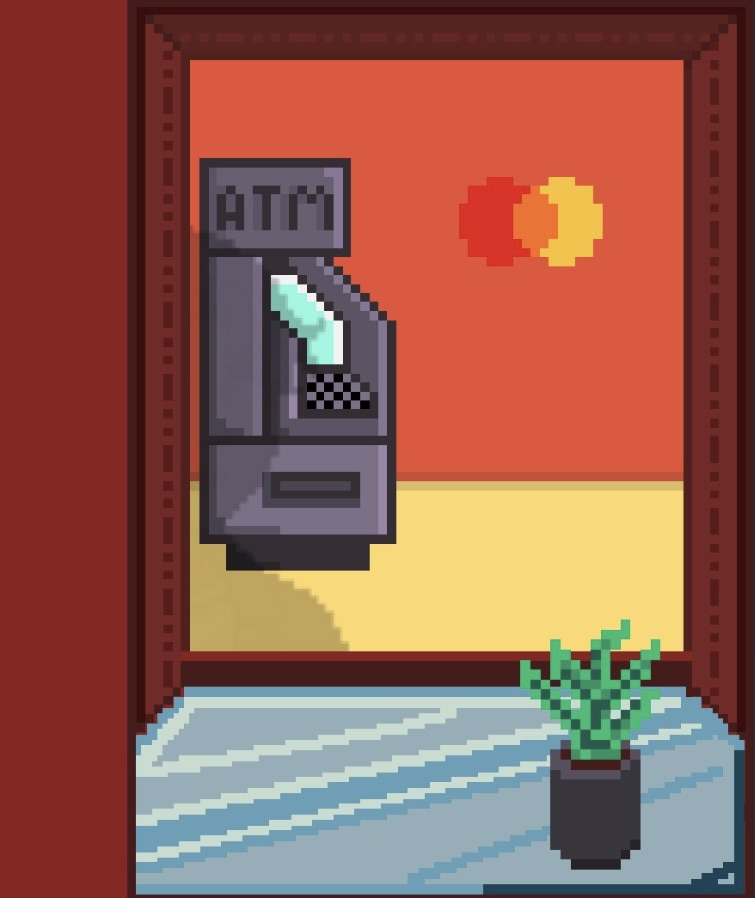

**Figura 18: Guichê do jogo**

**Fonte: Autoria Própria**

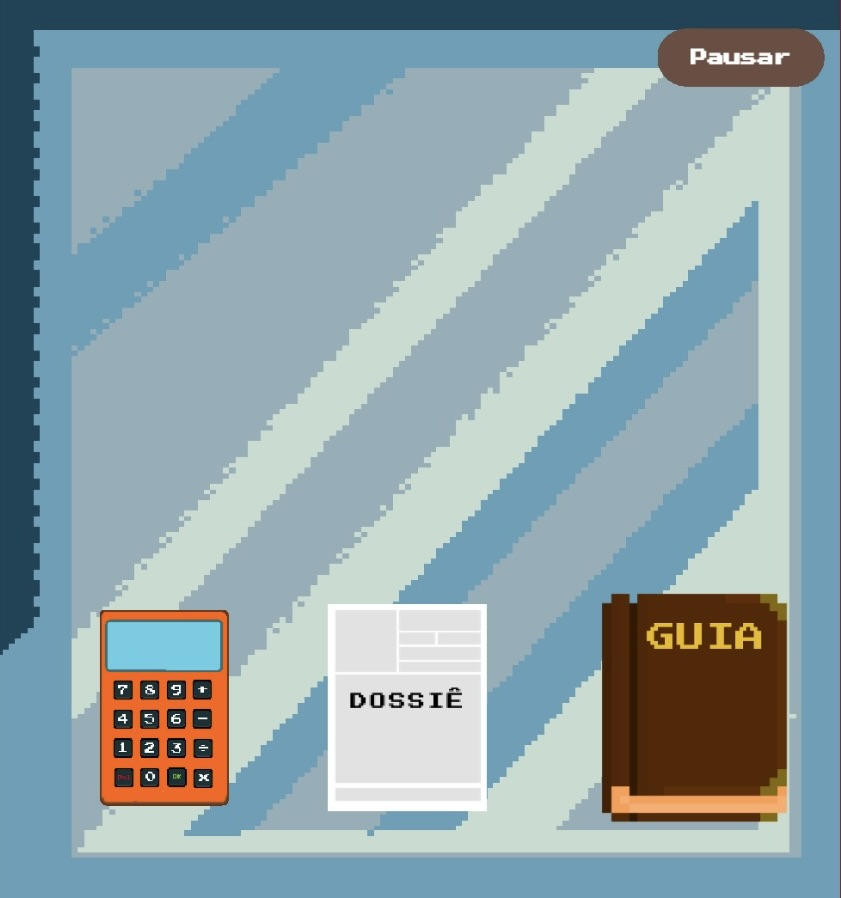

**Figura 19: Mesa do Jogador**

**Fonte: Autoria Própria**


### 3.3.2. Navegação pelo mundo 

Dentro do jogo, a "navegação" define-se pela progressão cronológica e pelo fluxo de personagens que entram e saem do campo de visão do jogador. O protagonista é um personagem **estacionário**, e por isso a movimentação no mundo é representada pela chegada dos clientes ao guichê.

**Fluxo de Navegação e Acesso**

As fases no jogo são divididas por dias úteis. De maneira que, a cada dia determinadas ferramentas e personagens fiquem disponíveis. Na tabela abaixo é possível visualizar como essas informações se distribuem ao longo do tempo:

|**Dia**|**Personagens**|
|---|---|
|0| Tutorial e Laíza |
|1| Cledson, Fabiana, Fernanda e Samantha |
|2| Vanessa, Roberto, Cledson e Lucas  |
|3| Heitor, Fernanda, Marcelo e Cledson|


### 3.3.3. Condições climáticas e temporais 

A dimensão temporal é a principal mecânica de pressão e limitação do jogo. Quanto ao clima, visto que a ambientação é restrita ao interior do escritório, sem janelas ou influência externa direta, este não possui papel relevante na experiência.

No que tange ao fator tempo, cada dia de jogo possui uma duração de 8 minutos reais, período em que os clientes chegam para serem atendidos. Logo, o jogador deve atender o maior número possível de pessoas com eficiência para garantir uma melhor performance e, consequentemente, acumular mais moedas ao final do expediente.

Para auxiliar nesse controle, um relógio digital posicionado sobre a bancada permite a consulta rápida do horário. Ao final do horário comercial, o guichê é fechado e o jogador é direcionado a uma tela de resultados, onde pode verificar seu desempenho e os erros cometidos ao longo do dia.


### 3.3.4. Concept Art 


**Figura 20: Concept Art do "Mestre dos Sistemas"**

**Fonte: Autoria Própria**

[Para melhor visualização, clique aqui](www.figma.com/design/z1Sf5av9HQ5RwBQ9CPld8L/Concept-Art?node-id=15-3)


### 3.3.5. Trilha sonora 


\# | titulo | ocorrência | autoria
--- | --- | --- | ---
1 | Música durante as fases | Durante as questões objetivas. | Pixabay - Lofi Relax Beat Loop BPM 88 Eb major ii V I
2 | Som do botão | Toda vez que um botão for acionado.| Pixabay -  freesoundeffects
3 | Som de fala | Durante o diálogo dos personagens e a apresentação das perguntas. | Efeito sonoro autoral
4 | Som de acerto | Quando o jogador acertar a pergunta. | Pixabay - freesound_community
5 | Som de erro | Quando o jogador errar a pergunta. | Pixabay - u_31vnwfmzt6
6 | Som de conquista | Quando o jogador completar o requisito de alguma das conquistas. | Pixabay - freesound_community

## 3.4. Inventário e Bestiário 

### 3.4.1. Inventário

\# | Item | Imagem | Como obter | Descrição |
--- | --- | --- | --- | --- 
1 | Garrafa d’água |  | Conquista “Primeiros de muitos” - Terminou o diálogo com o primeiro cliente (Cledson). | Como forma de parabenizar o jogador pela conclusão do primeiro cliente, ele irá receber uma garrafa de água que ficará posicionada embaixo do guichê.|
2 | Pôster de 1º dia |  | Conquista “Apenas o começo” - Conclua o primeiro dia. | Esse pôster é comemorativo após o final do primeiro dia. Ele ficará posicionado na parte superior da mesa do jogador, como forma de decoração de sua mesa. |
3 | Pôster de 2º dia |  | Conquista "um é bom dois é demais" - Conclua o segundo dia. | Esse pôster é comemorativo após o final do segundo dia. Ele ficará posicionado na parte superior da mesa do jogador, como forma de decoração de sua mesa. |
4 | Guia Customizado |  | Conquista “Nada escapa de mim” - Acerte todas as perguntas de um dia. | Depois de acertar todas as perguntas de um dia, o sprite do guia muda para um guia especial.|
5 | Relógio |   | Conquista “Veloz e furioso” - Atenda um cliente em menos de 25 segundos. | Após o jogador finalizar um cliente em menos de 25 segundos, ele irá receber um relógio que ficará posicionado embaixo do guichê.|
6 | Gatinho da Sorte Chinês |  | Conquista “Eu quero todos” - Ganhe todos os itens cosméticos | Ao desbloquear todos os itens, o jogador ganha um gato chinês, que ficará posicionado embaixo do guichê. |
7 | Estátua de melhor empregado |  | Conquista "mestre dos sistemas" - Zere o jogo. | Após concluir a prova final do jogo, o jogador irá vencer um troféu, que representa o mestre do sistema, que ficará posicionado embaixo do guichê.|

### 3.4.2. Bestiário

Não se aplica ao nosso jogo.

## 3.5. Gameflow (Diagrama de cenas) 

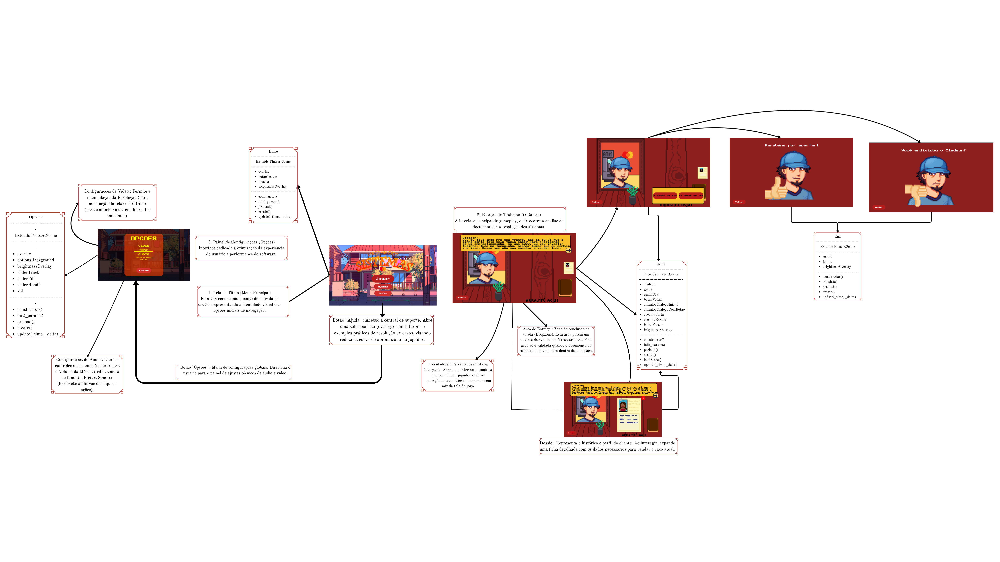

**Figura 21: Fluxograma do jogo**

**Fonte: Autoria Própria**

[Para melhor visualização, clique aqui](www.canva.com/design/DAHCWS-FpI4/4bMorS_QkclGci39m8TZ7A/edit?utm_content=DAHCWS-FpI4&utm_campaign=designshare&utm_medium=link2&utm_source=sharebutton)

## 3.6. Regras do jogo 

As regras do jogo são instruções que definem como a experiência deve ser conduzida, estabelecendo seus objetivos, as ações permitidas e proibidas, bem como as condições de início, desenvolvimento e término. Elas garantem uma experiência justa, organizada e divertida para todos os participantes.

O jogo é estruturado a partir de um sistema de progressão dividido em dias sequenciais, nos quais o jogador assume o papel de um atendente responsável por interagir com clientes, tomar decisões e gerenciar recursos financeiros. Ao iniciar cada dia, o jogador é apresentado a uma tela introdutória que exibe tanto o número do dia quanto suas regras específicas, estabelecendo o contexto necessário para a execução das atividades propostas.

No início da experiência, o jogador passa por um tutorial obrigatório conduzido por um personagem gerente, cujo objetivo é introduzir as mecânicas fundamentais do jogo. Após a conclusão desse tutorial, o jogador passa a operar dentro do loop principal da jogabilidade, que consiste no atendimento de clientes, uso de ferramentas de apoio e tomada de decisões que impactam diretamente seu desempenho e progressão.

Durante os dias 1, 2 e 3, o jogador tem acesso a diferentes recursos disponíveis em sua mesa de trabalho, como o guia financeiro, o dossiê dos clientes e uma calculadora. Esses elementos funcionam como ferramentas de suporte à tomada de decisão, permitindo que o jogador consulte informações relevantes antes de responder às solicitações dos clientes. Embora esses recursos não alterem diretamente a pontuação, seu uso adequado influencia significativamente a precisão das respostas e, consequentemente, o desempenho geral do jogador.

O núcleo da jogabilidade está no atendimento aos clientes, que ocorre por meio da seleção de respostas ou interações específicas. A cada ação realizada, o sistema valida a escolha do jogador com base nas informações disponíveis e nas regras estabelecidas. Quando o jogador realiza uma escolha correta, ele recebe uma recompensa em forma de dinheiro e avança no progresso do dia. Por outro lado, respostas incorretas resultam em penalizações, que podem incluir perda de recompensas ou impacto negativo no desempenho final. Cada dia possui um número finito de interações, sendo necessário completar todas elas para avançar.

Ao final do terceiro dia, o jogador é submetido a uma prova com o objetivo de avaliar os conhecimentos adquiridos ao longo da experiência. Essa prova é composta por cinco questões de maior complexidade em relação ao mostrado anteriormente, exigindo um nível mais elevado de compreensão dos conceitos trabalhados no jogo. Para ser aprovado, o jogador deve acertar pelo menos três das cinco questões, o que corresponde a um mínimo de 60% de aproveitamento. Caso não atinja esse critério, o jogador não poderá progredir e deverá repetir a tentativa até alcançar o desempenho necessário.

O desempenho do jogador nessa avaliação está diretamente relacionado ao desfecho da experiência. Caso o jogador atinja o percentual mínimo de acertos, ele alcança o final ótimo do jogo, que representa um desempenho satisfatório em termos de aprendizado. Além disso, como forma de recompensa adicional, o jogador desbloqueia um código do Mastercard Surpreenda, reforçando o reconhecimento pelo seu desempenho.

Assim, a prova atua não apenas como um elemento narrativo de conclusão, mas principalmente como uma métrica de avaliação do aprendizado do jogador, refletindo sua capacidade de aplicar corretamente os conhecimentos adquiridos ao longo dos dias anteriores.

Além do sistema principal de progressão, o jogo conta com um sistema de conquistas que recompensa o jogador ao cumprir determinados objetivos. Essas conquistas concedem itens estéticos, que podem ser ativados ou desativados pelo jogador conforme sua preferência, não influenciando diretamente a jogabilidade, mas contribuindo para a personalização da experiência.

---

**Minigames:** 

Aparecem em momentos específicos da progressão e seguem uma lógica de funcionamento baseada no modelo de entrada, processamento e saída. Cada um apresenta um objetivo claro e condições definidas de sucesso ou erro, podendo impactar tanto o progresso quanto as recompensas obtidas pelo jogador ao longo da experiência.

No primeiro dia, o minigame relacionado a personagem Fabiana se refere a consultar o saldo da personagem em seu cartão, portanto o jogador precisa aproximar o cartão a máquina, e digitar os números do cartão, que irá aparecer o seu saldo logo em seguida.

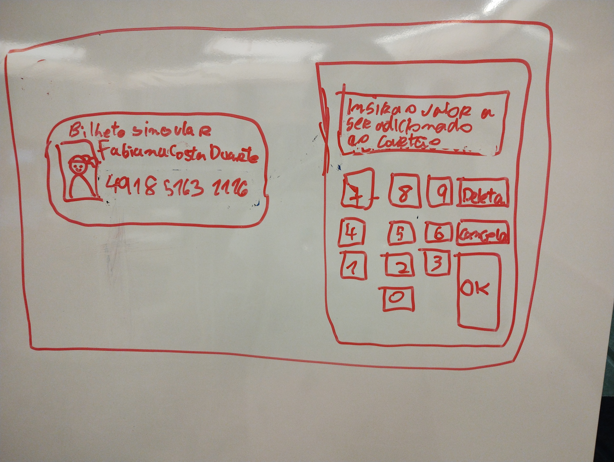

**Figura 22: Concept Art do Minigame da Fabiana**

**Fonte: Autoria Própria**

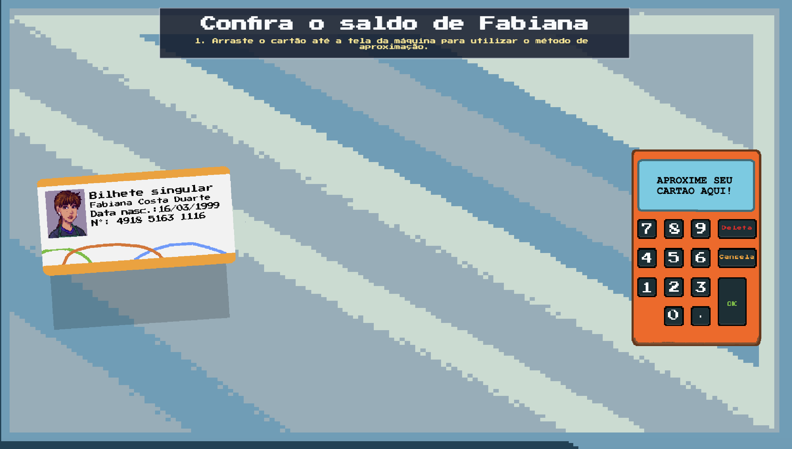

**Figura 23: Minigame da Fabiana funcional**

**Fonte: Autoria Própria**

---
No terceiro dia de jogo, o minigame relacionado ao personagem Marcelo se refere a achar os erros entre as duas identidades que se referem ao mesmo cadastro, mas existe uma inconsistência entre ambas, e o jogador precisa identificar os erros.


**Figura 24: Concept Art do Minigame do Marcelo**

**Fonte: Autoria Própria**

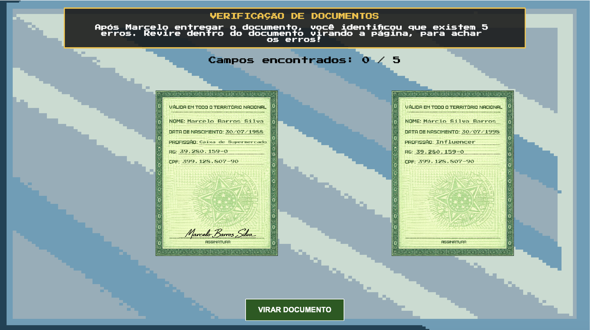

**Figura 25: Minigame do Marcelo funcional**

**Fonte: Autoria Própria**

---

Ao final de cada dia, o jogador participa de um minigame adicional de planejamento financeiro, no qual deve organizar elementos por meio de uma mecânica de clique. O sistema avalia a distribuição realizada, podendo conceder bônus em caso de organização correta ou não oferecer recompensas adicionais em caso de erro.


**Figura 26: Concept Art do Minigame de Planeamento Financeiro**

**Fonte: Autoria Própria** 


**Figura 27: Minigame do Planejamento Financeiro funcional**

**Fonte: Autoria Própria**

---

Por fim, existem restrições claras que orientam o funcionamento do sistema, a progressão do jogo está condicionada ao desempenho do jogador ao longo dos dias e, principalmente, ao resultado obtido na prova final. Dessa forma, o jogo estabelece regras bem definidas que conectam desempenho, aprendizagem e desfecho narrativo, garantindo coerência entre as ações do jogador e os resultados apresentados ao final da experiência.


## 3.7. Mecânicas do jogo 

\# | Mecânica | Descrição
--- | --- | ---
1 | Navegação entre telas | Ao clicar nos botões "Jogar", "Conquistas", "Carregar" ou "Opções", o sistema realiza a transição entre cenas e uma nova tela é exibida ao jogador.
2 | Atendimento de clientes | Ao selecionar, com clique ou em "enter", as respostas em diálogos com os clientes, o sistema valida a escolha com base nas informações disponíveis e há um feedback de acerto ou erro, com impacto no desempenho do jogador.
3 | Progressão de diálogo | Ao clicar na caixa de diálogo, o sistema controla o fluxo de diálogo e eventos e novas falas e opções são apresentadas.
4 | Tomada de decisão | O jogador escolhe entre as diferentes alternativas apresentadas, e o sistema compara a escolha feita com a resposta adequada, gerando consequências que podem resultar em recompensa ou penalidade.
5 | Consulta de informações | Ao acessar o guia financeiro ou o dossiê, o jogador obtém informações relevantes exibidads pelo sistema, que auxiliam na tomada de decisão ao longo do jogo.
6 | Sistema de minigames | O jogador realiza interações especificadas pelo tutorial de cada minigame, após analisar as iformações fornecidas, enquanto o sistema avalia o desempenho com base em critérios definidos, retornando resultados que influenciam o progresso.
7 | Planejamento financeiro | O jogador organiza recursos por meio de cliques, que selecionam ou desselecionam as caixas de alocamento de dinheiro naquelas despesas, e o sistema processa essa distribuição, avaliando sua coerência e podendo conceder bônus conforme o resultado.
8 | Sistema de conquistas | As ações do jogador são monitoradas continuamente, e o sistema desbloqueia recompensas estéticas ao identificar o cumprimento de objetivos específicos.
9 | Personalização | Ao longo do jogo, ao desbloquear conquistas, o jogador pode ver os itens desbloqueados em sua mesa.
10 | Configurações do jogo | O jogador ajusta parâmetros de áudio, vídeo, gameplay e acessibilidade, e o sistema modifica variáveis internas que resultam em mudanças na experiência visual, sonora e de jogabilidade.


## 3.8. Implementação Matemática de Animação/Movimento 

### Sobre o modelo matemático:

Para a implementação da física, sem utilizar funções prontas da biblioteca do Phaser, foram empregadas equações cinemáticas para calcular o movimento do objeto. No eixo Y, utilizamos equações do movimento uniformemente variado (MUV), enquanto no eixo X aplicamos equações de movimento uniforme.

Entretanto, diferentemente de uma formulação puramente analítica (contínua), a implementação foi realizada por meio de integração numérica discreta, utilizando incrementos de tempo constantes (dt). Dessa forma, as equações são aplicadas iterativamente a cada frame, o que pode gerar pequenas diferenças em relação às soluções analíticas exatas.

#### Constantes utilizadas:

- Tempo total: 4 segundos;
- Posição inicial (x, y): (100, 100);
- Posição final (x, y): dinâmica, calculada como (`width - 100`, `height - 100`), variando conforme a resolução da tela. Para uma resolução de 1920×1028, os valores resultantes são (1820, 928);
- Velocidade inicial no eixo y: 0 pixels/s;
- Intervalo de tempo: 0,016 s (aproximadamente 60 FPS).

#### Equações base - Eixo Y - MUV:

Velocidade:

$$V_y(t) = V_{yi} + a \cdot t$$

Posição:

$$Y(t) = Y_i + V_{yi} \cdot t + \dfrac{1}{2} a t^2$$

#### Adaptação para modelo discreto:

Atualização da velocidade:

$$V_y(t + \Delta t) = V_y(t) + a \cdot \Delta t$$

Atualização da posição:

$$Y(t + \Delta t) = Y(t) + V_y(t) \cdot \Delta t$$

#### Aceleração utilizada:

A aceleração foi definida como:

$$a = \dfrac{2(Y_f - Y_i)}{T^2}$$

Para intensificar o efeito visual, foi aplicado um fator multiplicativo de 5:

$$a = \dfrac{2(Y_f - Y_i)}{T^2} \cdot 5$$

Substituindo pelos valores de exemplo (resolução 1920×1028):

$$a = \dfrac{2(928 - 100)}{4^2} \cdot 5 = \dfrac{1656}{16} \cdot 5 = 103{,}5 \cdot 5 = 517{,}5 \text{ pixels/s}^2$$

#### Equações no código:

```js
this.a = (2 * (this.endY - this.startY)) / (this.totalTime ** 2) * 5;

scene.vy += scene.a * scene.dt;
scene.y += scene.vy * scene.dt;
```

#### Equações Base - Eixo X - MU:

Velocidade constante:

$$V_x = \dfrac{X_f - X_i}{T}$$

Posição:

$$X(t) = X_i + V_x \cdot t$$

#### Resultados obtidos para o eixo X (resolução 1920×1028):

$$V_x = \dfrac{1820 - 100}{4} = \dfrac{1720}{4} = 430 \text{ pixels/s}$$

#### Equações no código:

```js
this.vx = (this.endX - this.startX) / this.totalTime;

scene.x += scene.vx * scene.dt;
```

### Sobre o código:

#### Função:

Foi implementada a função `updateLogoMovement`, responsável por atualizar a posição do elemento gráfico com base nas variáveis de estado (posição, velocidade e aceleração), além dos parâmetros iniciais definidos. Essa função simula o movimento em tempo real por meio de atualizações incrementais.

#### Código da função:

```js
function updateLogoMovement(scene, startX, _startY, endX, endY) {
  scene.x += scene.vx * scene.dt;

  if (scene.x >= endX || scene.x <= startX) {
    scene.vx = -scene.vx;
    scene.logo.setTint(Phaser.Display.Color.RandomRGB().color);
  }

  scene.vy += scene.a * scene.dt;
  scene.y += scene.vy * scene.dt;

  const bounceFactor = 0.5;

  if (scene.y >= endY) {
    scene.y = endY;
    scene.vy = -scene.vy * bounceFactor;
    scene.logo.setTint(Phaser.Display.Color.RandomRGB().color);
  }

  scene.logo.setPosition(scene.x, scene.y);
}
```

#### Loop de atualização:

O loop de atualização executa a função `updateLogoMovement` a cada 16 milissegundos, garantindo a fluidez da animação. A variável `elapsedTime` controla o tempo total da simulação.

#### Código do loop:

```js
this.timerEvent = this.time.addEvent({
  delay: 16,
  loop: true,
  callback: () => {
    this.elapsedTime += 16 / 1000;

    updateLogoMovement(this, this.startX, this.startY, this.endX, this.endY);

    if (this.elapsedTime >= this.totalTime) {
      this.timerEvent.remove();
      this.scene.start(SCENES.MENU);
    }
  }
});
```

### Informações adicionais:

A utilização de integração numérica com passo de tempo constante (dt) permite uma simulação estável e independente da taxa de quadros. Embora existam pequenas diferenças em relação às equações contínuas, o comportamento geral do movimento permanece consistente com o modelo físico proposto.

Além disso, o sistema implementa colisões com inversão de velocidade no eixo X e colisão inelástica no eixo Y, utilizando coeficiente de restituição igual a 0,5, simulando perda de energia após o impacto. Em ambos os casos, ao ocorrer uma colisão, a cor do logo é alterada aleatoriamente como efeito visual.
# <a name="c4"></a>4. Desenvolvimento do Jogo

## 4.1. Desenvolvimento preliminar do jogo

A versão preliminar do jogo foi desenvolvida durante a Sprint 1. Como início, foi implementada a tela inicial com navegação entre cenas. Inicialmente as telas são Jogar, Opções e Ajuda, sendo possível acessar as cenas de Jogar e Opções. Um obstáculo durante esse momento do desevolvimento foi lidar com o escalonamento da tela em conjunto com as diferentes resoluções das imagens a ser utilizadas. Com uma pesquisa adequada dentro da documentação do Phaser, utilizou-se da propriedade "scale" do Phaser para lidar com a questão da responsividade. Isso concluído, aplicaremos o feedback do parceiro e seguiremos para a codificação de um sistema modular para o comportamento(AI) dos clientes que vão aparecendo ao longo do jogo.

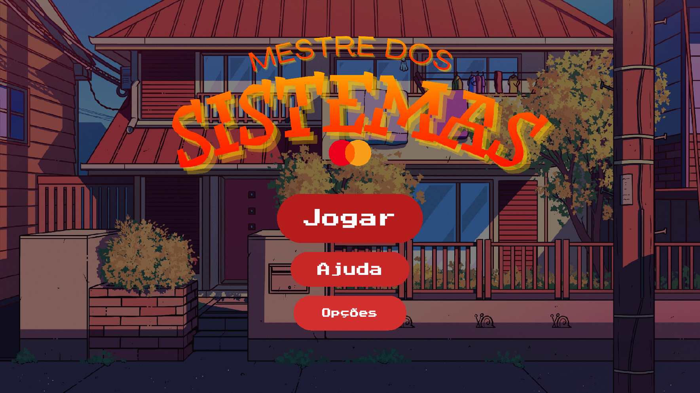

**Figura 28: Tela inicial com botões do desenvolvimento preliminar**

**Fonte: Autoria Própria**

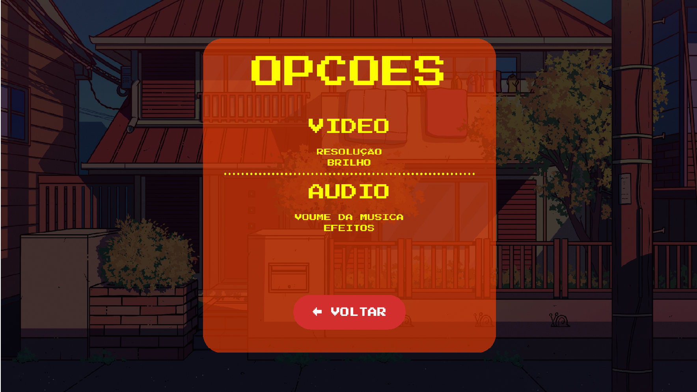

**Figura 29: Tela com as opções do jogo do desenvolvimento preliminar**

**Fonte: Autoria Própria**

## 4.2. Desenvolvimento básico do jogo 

Na Sprint 2, foi feita a primeira versão básica do jogo. Nesta versão, foi implementada a tela principal com o protótipo funcional do dia de trabalho, contendo caixa de diálogo, botões interativos e os elementos guia e dossiê sobre a mesa. Com isso, foram cumpridos os requisitos 2, 3 e 4 os quais solicitam, respectivamente: adicionar o guia de informações; implementar o dossiê; implementar os diálogos com perguntas.

Um obstáculo significativo durante o desenvolvimento foi a disparidade de conhecimento técnico entre os programadores atuais e o desenvolvedor anterior. Essa diferença gerou uma curva de aprendizado acentuada para alinhar o que já havia sido implementado no projeto ao conteúdo ministrado em aula, o que ocasionou um atraso de um dia no desenvolvimento do código.

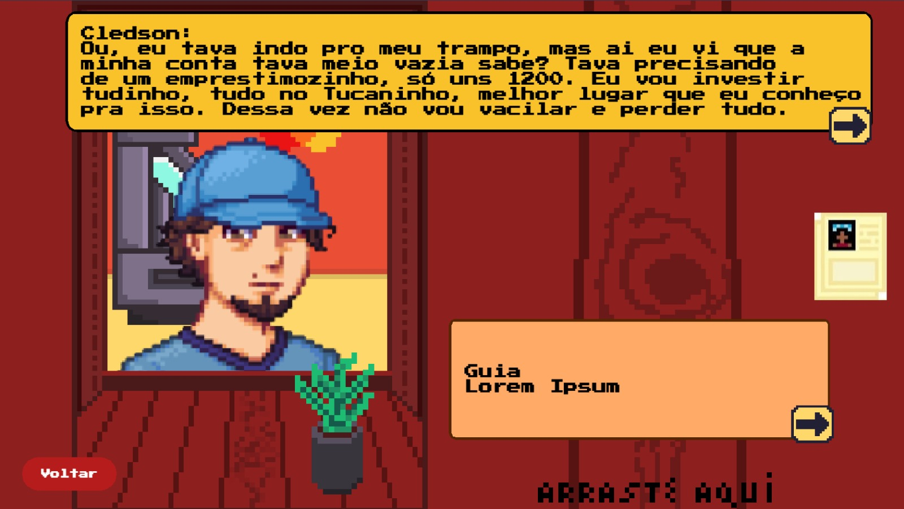

**Figura 30: Tela de jogo com guia aberto do desenvolvimento básico do jogo**

**Fonte: Autoria Própria**

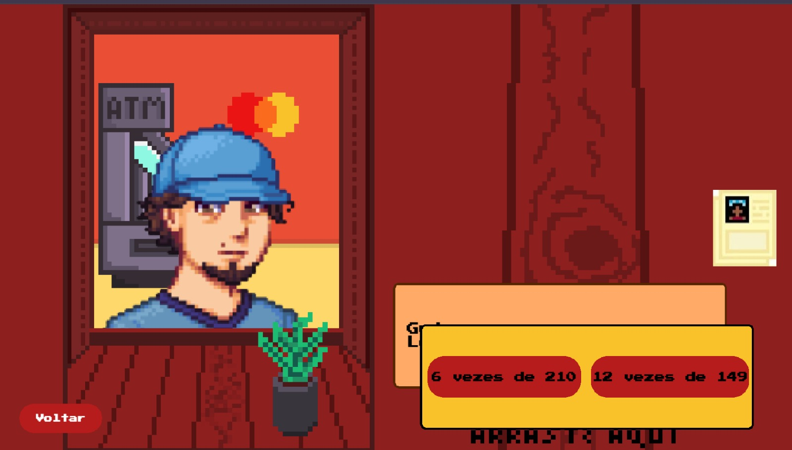

**Figura 31: Tela de jogo com caixa de escolha aberta do desenvolvimento básico do jogo**

**Fonte: Autoria Própria**


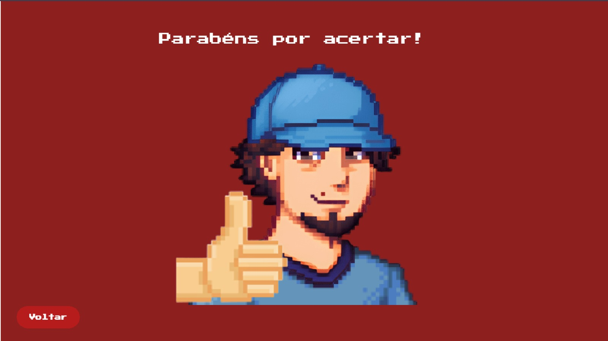

**Figura 32: Tela de fim do dia temporário com apenas feedback do atendimento do Cledson do desenvolvimento básico do jogo**

**Fonte: Autoria Própria**

## 4.3. Desenvolvimento intermediário do jogo 

Na Sprint 3, foi feita a versão intermediária do jogo. Nessa versão, o código foi completamente refatorado com base nos feedbacks recebidos durante a Sprint 2. O objetivo principal dessa etapa consistiu em aprimorar a organização do projeto, além de tornar o código mais modular e legível, facilitando a manutenção futura do sistema.

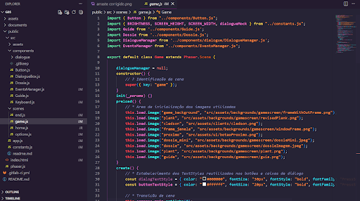

**Figura 33: Estrutura de pastas do projeto após a refatoração do código**

**Fonte: Autoria Própria**

Inicialmente, removeu-se a tela denominada Testes, visto que se encontrava desorganizada e não apresentava utilidade relevante para o estágio atual de desenvolvimento. Além disso, padronizou-se a nomenclatura dos arquivos e das classes para o idioma inglês. Como exemplo, a importação Opções, presente no arquivo index.js, foi renomeada para Options, mantendo a consistência com as demais partes do projeto.

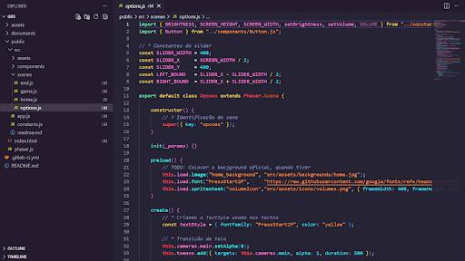

**Figura 34: Implementação da cena Options seguindo o padrão de nomenclatura em inglês.**

**Figura: Autoria Própria**

Outra mudança importante foi a reorganização do código principal da cena Game. As partes relacionadas ao Guia e ao Dossiê foram extraídas da implementação principal e encapsuladas em suas respectivas classes, o que tornou o código mais limpo e modular

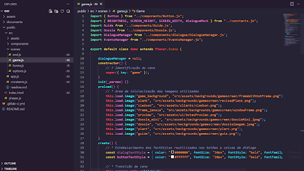

**Figura 35: Código principal da cena Game utilizando classes separadas para modularização do sistema.**

**Fonte: Autoria Própria**

Também se reorganizou o carregamento do cenário do jogo. O trecho anteriormente alocado no método create() foi movido para uma função específica chamada loadScenario(), melhorando a legibilidade e a organização do fluxo de execução da cena.
Adicionalmente, todo o sistema de diálogos do jogo foi reorganizado. O código anteriormente responsável pela DialogueBox foi transferido para uma nova classe chamada DialogueManager. Essa classe é responsável por exibir os diálogos na interface do jogo, gerenciar as escolhas feitas pelo jogador e carregar os diálogos dos personagens.Adicionalmente, todo o sistema de diálogos foi reestruturado. O código antes responsável pela DialogueBox foi transferido para uma nova classe, denominada DialogueManager. Essa classe assumiu a responsabilidade de exibir os diálogos na interface, gerenciar as escolhas do jogador e carregar as falas dos personagens.

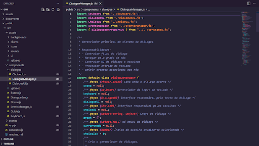

**Figura 36: Classe DialogueManager responsável por gerenciar os diálogos e escolhas do jogador.**

**Fonte: Autoria Própria**

Os diálogos passaram a utilizar uma estrutura baseada em nodes, organizados em arquivos no formato YAML. Esses dados são carregados dinamicamente pelo EventsManager, o qual seleciona os eventos de acordo com o dia de jogo e os personagens presentes naquele momento.

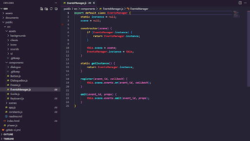

**Figura 37: Classe EventsManager responsável por controlar os eventos e diálogos do jogo.**

**Fonte: Autoria Própria**

A imagem apresenta o código-fonte da classe EventsManager, um componente vital para a arquitetura do jogo. Esta classe foi implementada utilizando o padrão de design Singleton, o que é comprovado pela verificação da propriedade estática instance dentro do construtor (constructor(scene)), e pelo método estático getInstance(). Essa abordagem assegura que exista apenas uma instância centralizada para o gerenciamento de eventos em toda a execução do jogo.

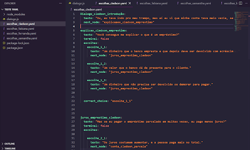

**Figura 38: Arquivo em YAML usando nodes para a fluidez do diálogo**

**Fonte: Autoria Própria**

Paralelamente, implementou-se a classe Keyboard, um utilitário destinado a centralizar o gerenciamento das entradas (inputs) do jogador. Tal classe facilita a captura das ações do usuário e permite que diferentes partes do sistema utilizem os comandos de maneira padronizada.

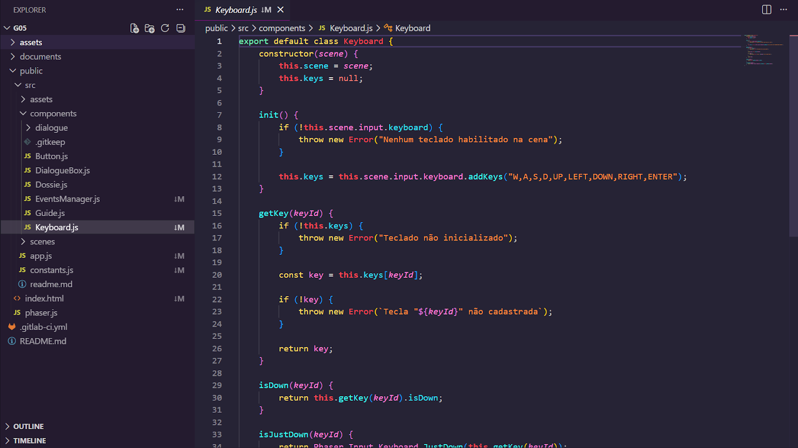

**Figura 39: Classe Keyboard utilizada para centralizar o gerenciamento dos inputs do jogador.**

**Fonte: Autoria Própria**

Por fim, executou-se uma revisão geral do código com o intuito de remover trechos redundantes e aprimorar a arquitetura geral do projeto. Essas mudanças tornaram o sistema mais limpo, modular e preparado para as etapas subsequentes de desenvolvimento.
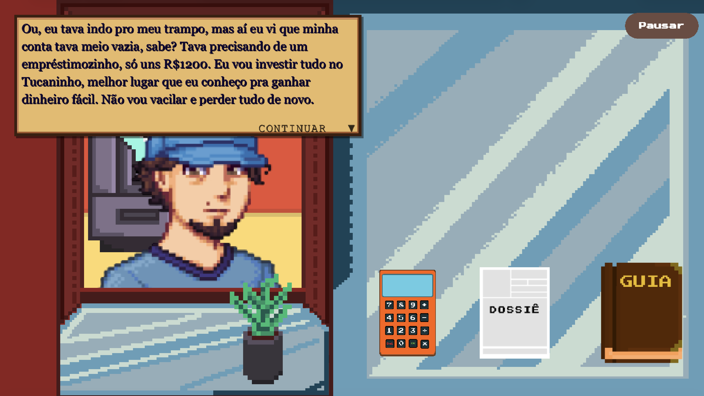

**Figura 40: Exemplo do diálogo do personagem**

**Fonte: Autoria Própria**


**Figura 41: Exemplo das resposta que o jogador pode dar ao personagem**

**Fonte: Autoria Própria**


**Figura 42: Exemplo de feedback imediato de erro ou acerto na resposta do jogador**

**Fonte: Autoria Própria**


## 4.4. Desenvolvimento final do MVP 

Para a conclusão do MVP do nosso jogo, o código passou por uma revisão completa e foi refatorado conforme as melhores práticas de desenvolvimento. O objetivo principal foi corrigir pequenos erros de lógica e garantir que a organização do projeto permanecesse *modular, legível e de fácil manutenção*.

### Principais Implementações e Melhorias:

*Arquitetura de Managers:* Uma mudança estrutural importante foi a implementação de novos gerenciadores (managers). Eles agora centralizam as responsabilidades sobre as conquistas, o dossiê, os minijogos e a economia (dinheiro) do jogador.
    
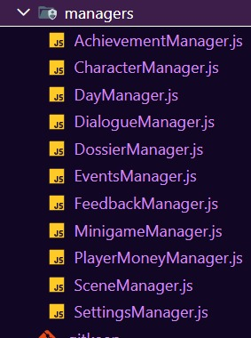

**Figura 43: Arquitetura de Managers dentro do código**

**Fonte: Autoria Própria**
    
*Finalização dos dias:*

	- Ao longo do projeto, criamos dentro da pasta src/documents/assets/clients diversos arquivos .yaml com o nome dos personagens, onde é configurado o diálogo daquele personagem. Para conectar todos esses diálogos e fazer com que eles estejam na ordem correta do jogo, criamos dentro de src/documents/assets/characters um arquivo characters.yaml, onde lá está em ordem todos os personagens que irão aparecer em sua ordem correta, conectando os diálogos pela constante "days" que determina o dia em que o personagem irá aparecer (1, 2 ou 3) e "order" que determina a ordem do personagem em um dia (1, 2 3 ou 4).

*Minijogo de Planejamento Financeiro:* Implementamos uma nova mecânica baseada em perguntas e respostas. O sistema funciona da seguinte forma:
    
    - *Acerto:* O jogador recebe *R$ 40,00*.
        
    - *Erro:* O jogador não recebe nenhuma recompensa.
        
*Minijogos de Transição:* Desenvolvemos o gerenciador de minijogos que ocorrem durante o dia, logo após o atendimento de seus respectivos clientes. Alguns desses desafios já foram prototipados, como o da personagem *Fabiana*, ilustrado abaixo:
    


**Figura 44: Minigame da Fabiana funcional**

**Fonte: Autoria Própria**

    
- *Sistema de Conquistas:* A estrutura base das conquistas já está operacional. No momento, uma conquista inicial foi implementada para fins de demonstração; contudo, a implementação de todo o catálogo de conquistas está prevista para a *Sprint 5*.
- Sons:
	- Na segunda semana da sprint 4 criamos e implementamos um jogo de gerenciamento financeiro no final de cada dia, o jogo foi feito primeiramente em html e posteriormente passado para JavaScript, o mini game é simples para não  obstruir o ciclo de jogo principal já quebrado por  outros mini jogos, a gameplay tem o jogador marcar quais despensas serão cortadas de suas contas até que seus gastos se equalizem a seu lucro do trabalho com gerente de finanças
- Calculadora: 

  - Além disso, durante essa sprint, foi implementada uma calculadora interativa integrada à HUD do jogo, estruturada por meio de um container centralizado que organiza seus elementos visuais e funcionais. Os botões foram posicionados com base em um sistema de grid, permitindo alinhamento consistente com o asset e maior clareza no código. A interatividade foi viabilizada por hitboxes invisíveis, garantindo exatidão nos toques sem comprometer o design. Em termos de funcionalidade, a calculadora realiza operações básicas, além de comandos como deleção de caracteres e limpeza total. Do ponto de vista do usuário, a ferramenta contribui diretamente para a experiência ao oferecer um recurso intuitivo (ao utilizar o conceito de affordance) e integrado ao ambiente do jogo, reduzindo a necessidade de elementos externos e, assim, reforçando a imersão do jogador.

- Dossiê: Agora, o dossiê atualiza conforme qual cliente etá sendo atendido atualmente, em vez de ser sempre o Cledson, como anteriormente.

## 4.5. Revisão do MVP 

Durante o refinamento do MVP foi feita a refatoração inicial do código e refinamentos dos feedbacks da Mastercard e dos professores.

Principais mudanças:

- Implementação de contextualização do jogo:
  - Nos testes foi identificado que parte dos jogadores não entendia com clareza seu papel dentro do jogo logo no início. Para resolver isso, foi adicionada uma contextualização narrativa com a personagem Laíza, explicando a função do jogador, o objetivo do expediente e a lógica geral da experiência já na abertura da campanha.

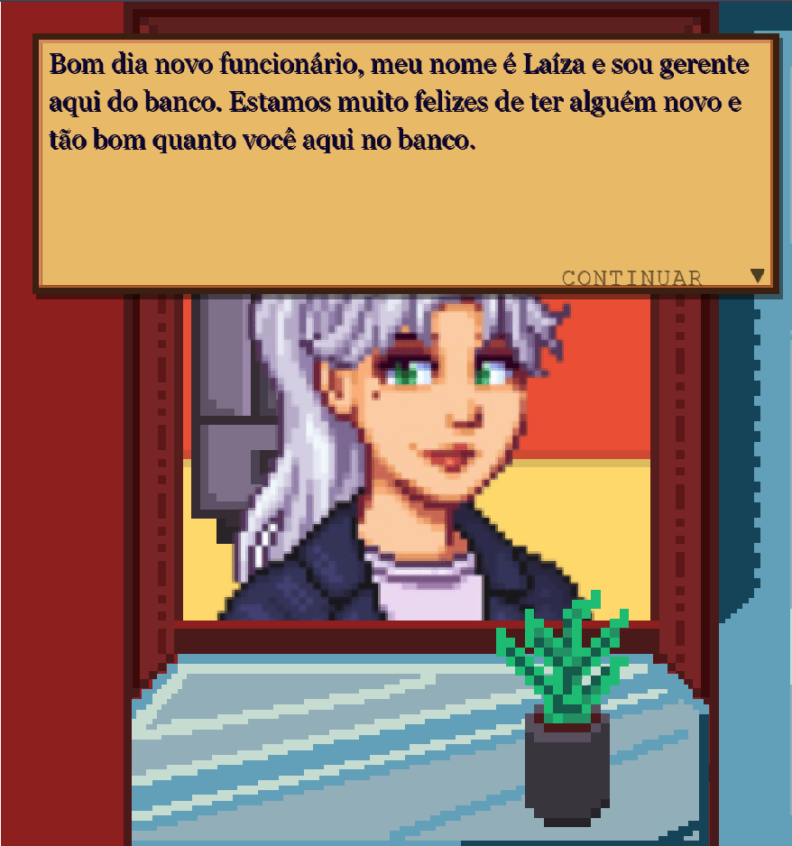

**Figura 45: Diálogo com a Chefe (Laíza)**

**Fonte: Autoria Própria**

Mini jogo do fim do dia:

  - Um dos principais feedbacks dos testes foi que o minijogo de fim do dia era pouco intuitivo, rústico e não deixava claro o impacto das decisões. Para corrigir isso, ele foi reformulado visual e mecanicamente. A nova versão organiza o planejamento em etapas, mostra melhor o saldo disponível, explicita o efeito das escolhas e adiciona consequências mais claras para contas adiadas, fundo de emergência, estabilidade e bem-estar.

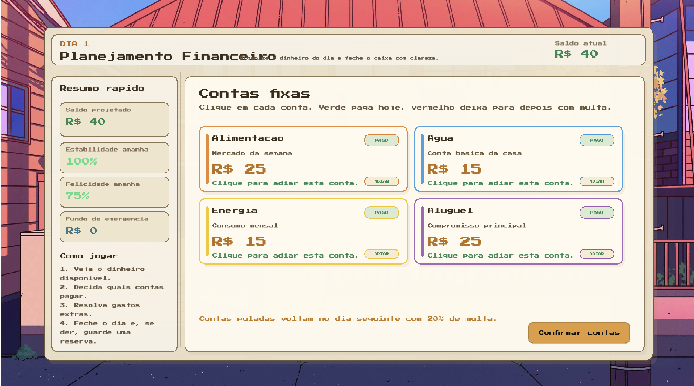

**Figura 46: Minigame do fim do dia (planejamento financeiro)**

**Fonte: Autoria Própria**

- Tutorial
  - Os testes mostraram que o tutorial estava confuso, com muitos elementos clicáveis ao mesmo tempo e pouco direcionamento sobre o que fazer primeiro. Para resolver isso, o onboarding foi refeito em formato guiado, destacando separadamente diálogo, dossiê, calculadora, guia e pausa, deixando o início da experiência mais claro e consistente.

- Melhorias aplicadas a partir dos feedbacks dos testes:
  - Muitos jogadores ignoravam ou não percebiam a importância das ferramentas de apoio. Para corrigir isso, o guia passou a ter navegação por páginas, sumário e progressão por dia, o dossiê passou a ser atualizado de acordo com o cliente atual, e a calculadora foi integrada de forma mais estável à HUD.
  - Houve reclamações de que o guia era pouco intuitivo e difícil de navegar. Como melhoria, ele foi reorganizado em páginas com botões de navegação, fechamento, retorno ao sumário e desbloqueio progressivo de conteúdo conforme o avanço do jogador.
  - O dossiê antes parecia pouco útil e estático. Agora ele acompanha o cliente em atendimento, exibindo informações atualizadas de forma contextualizada, o que reforça sua função dentro da tomada de decisão.
  - A calculadora foi apontada como confusa e pouco integrada. Para resolver isso, ela foi reconstruída como ferramenta funcional da interface, com operações básicas, deleção, melhor alinhamento visual e uso direto durante os atendimentos.
  - Os testes também apontaram dificuldade em perceber consequências e aprendizado após os erros. Como resposta, o jogo passou a trabalhar melhor a sequência entre atendimento, resumo do dia e planejamento financeiro, deixando mais claro que as decisões afetam diretamente o restante da campanha.
  - Parte dos jogadores relatou dificuldade de continuidade e retomada da experiência. Para melhorar isso, foram implementados autosave, sistema de carregamento por slots e melhorias no menu de pausa, tornando a progressão mais confiável e menos dependente de uma única sessão contínua.
  - O interesse por recompensa e progressão também apareceu como oportunidade de melhoria. Em resposta, foi expandido o sistema de conquistas, com desbloqueios visuais e itens cosméticos que reforçam a sensação de progresso ao longo da campanha.
  - Os testes remotos ainda mostraram necessidade de mais conforto de uso e personalização. Por isso, foram adicionadas opções de acessibilidade e configuração, como brilho, volume, velocidade do texto, contraste, filtro de cor, tamanho de fonte e tela cheia.

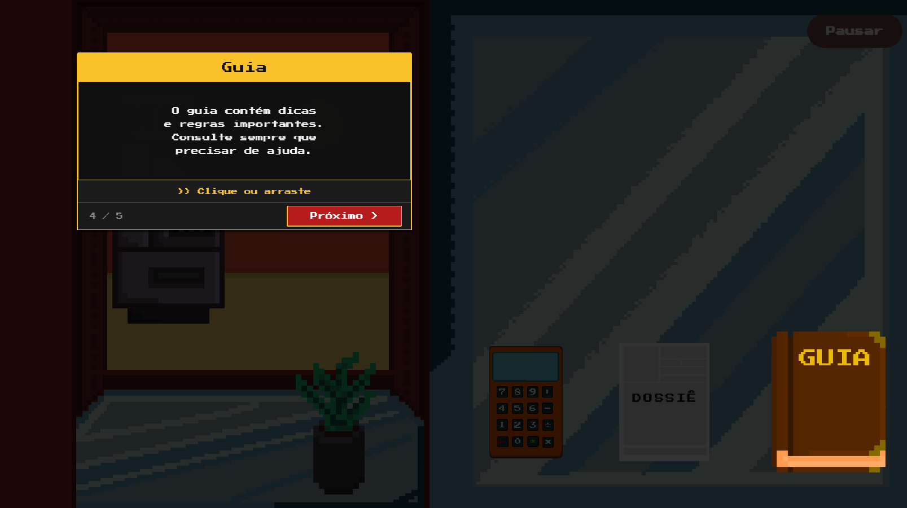

**Figura 47: Tutorial do Guia**

**Fonte: Autoria Própria**

# <a name="c5"></a>5. Testes

## 5.1. Casos de Teste 

| # | Pré-condição | Descrição do teste | Pós-condição esperada |
|---|---|---|---|
| 1 | Jogo iniciado na tela inicial | Clicar no botão **Jogar** | O jogo deve iniciar uma nova campanha corretamente |
| 2 | Tela inicial com autosave ou slot válido | Clicar em **Continuar** ou carregar um save | O jogo deve retomar o progresso salvo corretamente |
| 3 | Jogo iniciado na tela inicial | Clicar em **Opções** e depois em **Voltar** | A tela de opções deve abrir e retornar ao menu sem erros |
| 4 | Jogo iniciado na tela inicial | Clicar em **Conquistas** e depois em **Voltar** | A tela de conquistas deve abrir e retornar ao menu normalmente |
| 5 | Cena de jogo iniciada | Verificar a interface principal do jogo | Os elementos essenciais da interface, como guia, dossiê, calculadora e botão de pausa, devem aparecer corretamente |
| 6 | Primeiro dia da campanha iniciado | Aguardar o tutorial de interface | O tutorial deve apresentar os principais elementos antes do primeiro atendimento |
| 7 | Cena de jogo ativa | Abrir e fechar o **Dossiê** | O dossiê deve mostrar as informações do cliente e fechar corretamente |
| 8 | Cena de jogo ativa | Abrir e navegar pelo **Guia** | O guia deve abrir, permitir troca de páginas e exibir o conteúdo desbloqueado do dia atual |
| 9 | Cena de jogo ativa | Abrir a **Calculadora** e realizar uma conta simples | O painel deve abrir e exibir o resultado correto da operação |
| 10 | Cena de jogo ativa | Clicar no botão **Pausar** | O menu de pausa deve abrir corretamente |
| 11 | Menu de pausa aberto | Salvar a campanha em um slot manual | O progresso atual deve ser salvo corretamente |
| 12 | Menu de pausa aberto | Carregar um save existente | O jogo deve retomar a campanha a partir do save escolhido |
| 13 | Menu de pausa aberto | Clicar em **Menu** | O jogo deve retornar ao menu principal |
| 14 | Diálogo iniciado | Pressionar **ESPAÇO** ou **ENTER** durante a digitação | O texto deve ser exibido por completo imediatamente |
| 15 | Texto exibido com escolhas disponíveis | Navegar entre opções e confirmar uma resposta | A escolha deve ser registrada e o jogo deve reagir corretamente |
| 16 | Cliente com minigame associado finalizou o diálogo | Aguardar a transição | O minigame correspondente deve iniciar corretamente |
| 17 | Atendimento de um cliente concluído | Aguardar o fluxo seguinte | O personagem deve sair da cena e o próximo atendimento deve começar corretamente |
| 18 | Último cliente do dia atendido | Finalizar o expediente | O jogo deve abrir o resumo do dia e seguir para o minigame de planejamento financeiro |
| 19 | Resumo do dia aberto com erros registrados | Avançar para a próxima etapa | O feedback do dia deve ser exibido corretamente e o jogo deve seguir sem travar |
| 20 | Minigame de planejamento financeiro iniciado | Concluir todas as etapas do planejamento | O saldo final deve ser calculado corretamente e o dia deve ser encerrado |
| 21 | Minigame de Fabiana iniciado | Desbloquear a maquininha e inserir o número correto do cartão | O saldo da cliente deve ser exibido e o minigame deve poder ser concluído |
| 22 | Minigame de Marcelo iniciado | Encontrar todos os campos falsos do documento | O progresso deve ser atualizado e o minigame deve terminar corretamente |
| 23 | Minigame de custos iniciado | Selecionar gastos e finalizar | O total deve ser calculado corretamente e o minigame deve encerrar |
| 24 | Uma conquista é desbloqueada durante a campanha | Aguardar a reação visual do jogo | O jogo deve registrar e exibir a conquista corretamente |
| 25 | Último dia útil concluído | Aguardar a transição para a prova final | A prova deve iniciar corretamente |
| 26 | Prova final iniciada | Responder as perguntas até o fim | O jogo deve calcular o resultado e seguir para o fluxo final |
| 27 | Fluxo final iniciado com desempenho alto | Concluir a prova e avançar até a tela de final | O jogo deve exibir corretamente um dos finais positivos, de acordo com o desempenho do jogador |
| 28 | Fluxo final iniciado com desempenho baixo | Concluir a prova e avançar até a tela de final | O jogo deve exibir corretamente o final negativo, de acordo com o desempenho do jogador |
| 29 | Recado final aberto | Clicar em **Menu** | O recado final deve ser exibido corretamente e o jogo deve retornar ao menu principal |
| 30 | Jogo aberto em diferentes resoluções ou após múltiplas transições entre cenas | Redimensionar a janela e repetir navegações entre menu, opções, conquistas, saves e jogo | Os elementos da interface devem permanecer organizados e o jogo deve continuar funcionando sem travamentos |

## 5.2.1 Registros de testes

Os testes de jogabilidade foram realizados para verificar, na prática, como o jogo se comporta nas mãos de usuários reais. A intenção aqui foi sair do “funciona no código” e entender se o jogador consegue jogar, compreender e avançar sem nenhum tipo de dificuldade.

Foram aplicados dois formatos de teste: Os testes de guerrilha trouxeram interações diretas, rápidas e sem preparo, expondo imediatamente pontos de confusão ou quebra de fluxo. Já os testes remotos com público-alvo permitiram coletar respostas mais estruturadas, com maior volume de participantes e uma visão mais próxima do uso real.

A junção desses dois formatos permitiu identificar tanto problemas evidentes quanto padrões de comportamento, servindo como base concreta para ajustes no jogo. 

### 5.2.1.1 Registro dos testes de guerrilha (Parte 1)


Os testes de guerrilha foram realizados presencialmente, em ambiente público, abordando pessoas aleatórias para jogar sem qualquer explicação prévia. O objetivo foi validar se o jogo se sustenta sozinho: se o jogador entende o que fazer, como interagir e consegue avançar apenas pela interface e pelos elementos apresentados em tela.

O principal diferencial dessa etapa foi a forma de coleta dos dados. Em vez de utilizar formulários genéricos, foi desenvolvido um sistema próprio para registro dos testes, acessível em: [guerrilha.vercel.app/](https://guerrilha.vercel.app/)

Esse sistema permitiu registrar respostas e observações em tempo real, sem interromper o fluxo do teste. Além disso, trouxe a possibilidade de cruzar dados instantaneamente, permitindo analisar padrões de comportamento entre jogadores, identificar recorrência de erros e segmentar respostas por perfil; algo inviável com ferramentas tradicionais.

Os testes deixaram claro que o início do jogo funciona bem em termos de entrada, mas rapidamente surgem problemas de interpretação no fluxo. Um dos pontos mais críticos foi o tutorial: ele apresenta muitos elementos interativos ao mesmo tempo, levando jogadores a clicarem em ícones como dossiê, guia e calculadora, mesmo quando a ação esperada era simplesmente continuar o diálogo. Isso gerou confusão direta e fez com que parte dos jogadores travasse logo no começo.

Outro problema recorrente foi o não uso das ferramentas principais do jogo. A maioria dos jogadores não abriu o dossiê, não utilizou o guia e ignorou a calculadora nas primeiras interações. Em vários casos, essas ferramentas só passaram a ser usadas depois de intervenção externa. Isso mostra que o jogo não comunica de forma eficaz nem a existência, nem a importância desses recursos.

A calculadora, em específico, apresentou múltiplos problemas. Jogadores relataram dificuldade para entender seu funcionamento, botões pequenos, ausência de funcionalidades básicas como ponto decimal e, principalmente, problemas de camada: ela sobrepunha o dossiê de forma inadequada e parecia não responder corretamente, levando alguns a acreditarem que estava quebrada.

O guia também apresentou falhas claras. Alguns jogadores abriram, mas não souberam navegar entre páginas. Outros sequer perceberam que ele existia. Além disso, houve casos em que o uso do guia interferiu negativamente na experiência, como bugs no som de texto. Em situações práticas, jogadores que não utilizaram o guia ficaram significativamente mais lentos ou erraram mais, evidenciando que ele é importante, mas mal integrado.

As decisões dentro do jogo também apresentaram um padrão problemático. Vários jogadores apontaram que as alternativas de resposta não são equilibradas: frequentemente existe uma opção que parece claramente correta e outras que não parecem relacionadas. Isso reduz a necessidade de raciocínio e transforma parte das decisões em reconhecimento superficial, em vez de análise real da situação. Além disso, o excesso de texto no contexto das perguntas fez com que alguns jogadores simplesmente ignorassem partes importantes da informação.

Outro ponto crítico foi o entendimento do sistema geral do jogo. Muitos jogadores não perceberam que ganhavam dinheiro ao acertar, não entenderam o que fazer com o dinheiro restante e ficaram confusos na etapa de planejamento financeiro. Também houve dificuldade em entender feedbacks de erro ao final do dia, o que compromete o aprendizado proposto.

Em termos de interface, surgiram vários problemas de comunicação visual. Elementos não clicáveis pareciam interativos, enquanto ações importantes, como o botão de confirmar, não tinham destaque suficiente. A cor da caixa de respostas não ajudava na leitura e houve relatos de dificuldade até para enxergar onde confirmar uma escolha. Também houve confusão com o botão de voltar, que foi interpretado de forma errada em diferentes contextos.

Apesar dos problemas, os pontos positivos foram consistentes. Os jogadores destacaram os diálogos, os personagens, a estética, a proposta educativa e a variedade de cenários financeiros como os principais acertos. A presença da calculadora e a necessidade de buscar informação também foram vistas como diferenciais interessantes, mesmo com problemas de execução.

No geral, os testes não apontam falhas espalhadas, mas sim problemas bem concentrados em comunicação, onboarding e clareza de sistemas. O jogo tem uma base sólida em proposta, conteúdo e engajamento, mas depende de ajustes diretos na forma como orienta o jogador, apresenta suas ferramentas e estrutura suas decisões para que a experiência funcione de forma consistente sem depender de explicação externa.

Os testes de guerrilha resultaram em um total de 10 sessões com jogadores distintos, permitindo observar diferentes perfis de uso e comportamentos recorrentes ao longo da experiência. Para fins de apresentação no GDD, foram selecionados 3 testes representativos, que demonstram de forma clara os principais padrões identificados durante a coleta. Os demais registros, assim como a visualização completa dos dados e cruzamentos realizados, podem ser acessados diretamente pela plataforma desenvolvida pela equipe em: [guerrilha.vercel.app/](https://guerrilha.vercel.app/)

### Testador 1 — Ana

| Pergunta | Resposta |
|----------|----------|
| Nome do testador | Ana |
| Qual a sua idade? | 19–24 anos |
| Com que frequência você joga? | Quase todo dia |
| Qual seu nível de conhecimento financeiro? | Entendo o básico |
| Você recomendaria o jogo? | Com certeza |
| Você aprendeu algo novo com o jogo? | Aprendi bastante |
| Você teve travamentos durante o jogo? | Sim, algumas vezes |
| O que você achou do jogo? | Gostei |
| O que poderia melhorar no jogo? | Melhorar feedback visual |
| Você conseguiu iniciar o jogo? | Sim, sem dificuldades |
| O objetivo do jogo ficou claro? | Ficou claro após jogar |
| O tutorial foi útil? | Útil, mas faltou algo |
| Você usou as ferramentas disponíveis? | Usei algumas |
| Como foi sua progressão no jogo? | Avancei facilmente |
| Você percebeu as consequências das suas ações? | Não percebi |
| Os cenários dos clientes pareceram realistas? | Muito realistas |
| As explicações de erro foram claras? | Muito claras |
| Você mudaria algum hábito após jogar? | Sim, com certeza |
| O que achou do visual em pixel art? | Adorei |
| Qual nota você daria para o jogo? | 9 |

---

### Testador 2 — Bruno

| Pergunta | Resposta |
|----------|----------|
| Nome do testador | Bruno |
| Qual a sua idade? | 16–18 anos |
| Com que frequência você joga? | Toda semana |
| Qual seu nível de conhecimento financeiro? | Nenhum conhecimento |
| Você recomendaria o jogo? | Com certeza |
| Você aprendeu algo novo com o jogo? | Revisei o que já sabia |
| Você teve travamentos durante o jogo? | Não |
| O que você achou do jogo? | Gostei |
| O que poderia melhorar no jogo? | Tutorial mais claro |
| Você conseguiu iniciar o jogo? | Sim, sem dificuldades |
| O objetivo do jogo ficou claro? | Imediatamente claro |
| O tutorial foi útil? | Muito útil |
| Você usou as ferramentas disponíveis? | Todas sem dificuldade |
| Como foi sua progressão no jogo? | Precisei repetir |
| Você percebeu as consequências das suas ações? | Não percebi |
| Os cenários dos clientes pareceram realistas? | Moderadamente |
| As explicações de erro foram claras? | Razoáveis |
| Você mudaria algum hábito após jogar? | Talvez |
| O que achou do visual em pixel art? | Gostei bastante |
| Qual nota você daria para o jogo? | 8 |

---

### Testador 3 — Carla

| Pergunta | Resposta |
|----------|----------|
| Nome do testador | Carla |
| Qual a sua idade? | 25–30 anos |
| Com que frequência você joga? | Raramente |
| Qual seu nível de conhecimento financeiro? | Sei usar crédito e débito |
| Você recomendaria o jogo? | Com certeza |
| Você aprendeu algo novo com o jogo? | Aprendi algumas coisas |
| Você teve travamentos durante o jogo? | Sim, várias vezes |
| O que você achou do jogo? | Mais ou menos |
| O que poderia melhorar no jogo? | Melhorar estabilidade |
| Você conseguiu iniciar o jogo? | Precisei de ajuda |
| O objetivo do jogo ficou claro? | Não ficou claro |
| O tutorial foi útil? | Não ajudou muito |
| Você usou as ferramentas disponíveis? | Tive dificuldade |
| Como foi sua progressão no jogo? | Avancei lentamente |
| Você percebeu as consequências das suas ações? | Percebi mais ou menos |
| Os cenários dos clientes pareceram realistas? | Muito realistas |
| As explicações de erro foram claras? | Um pouco confusas |
| Você mudaria algum hábito após jogar? | Provavelmente não |
| O que achou do visual em pixel art? | Adorei |
| Qual nota você daria para o jogo? | 7 |

### 5.2.1.2 Registro dos testes com público-alvo

Os testes remotos foram realizados de forma online, por meio de um formulário estruturado e distribuído para o público-alvo do projeto. Diferente dos testes de guerrilha, que tinham como foco avaliar a experiência sem qualquer mediação, esta etapa buscou validar o jogo em um contexto real de uso, considerando jogadores interagindo de forma independente, em seus próprios dispositivos e ambientes.

A coleta de dados ocorreu de maneira assíncrona e totalmente anônima, permitindo que os participantes respondessem no seu próprio ritmo, sem interferência externa. Isso resultou em respostas mais completas e reflexivas, especialmente em relação à percepção de aprendizado, clareza das mecânicas e entendimento dos sistemas do jogo. Por outro lado, exigiu um cuidado maior na construção do formulário, garantindo objetividade e alinhamento com os objetivos do projeto.

O formulário seguiu a estrutura recomendada para testes com público-alvo, sendo dividido em cinco blocos: apresentação e consentimento, perfil do jogador, avaliação da experiência, análise de regras e sistemas, e comentários abertos. Essa organização permitiu cruzar dados quantitativos e qualitativos, identificando padrões de comportamento, dificuldades recorrentes e percepções gerais sobre o jogo.

Ao todo, foram coletadas 24 respostas, representando uma amostra mais ampla e consistente do público-alvo. Diferente dos testes de guerrilha, nesta etapa não houve necessidade de filtragem ou seleção de casos específicos, uma vez que os dados foram analisados de forma agregada, permitindo visualizar tendências gerais de uso e percepção.

Os resultados indicam uma recepção positiva do jogo. A maioria dos participantes afirmou que recomendaria a experiência e relatou ter aprendido algo novo, reforçando o alinhamento do projeto com seu objetivo educacional. Além disso, o objetivo do jogo foi considerado claro para grande parte dos jogadores, e a maioria conseguiu iniciar a experiência sem dificuldades significativas.

Ainda assim, alguns pontos críticos observados anteriormente se mantiveram. O uso das ferramentas, como o guia e a calculadora, continua sendo um ponto de fricção, com parte dos jogadores relatando dificuldade ou uso parcial desses recursos. O tutorial, embora melhor avaliado do que nos testes presenciais, ainda apresenta limitações em termos de clareza e direcionamento.

A percepção dos cenários foi majoritariamente positiva, com a maioria dos participantes considerando as situações apresentadas realistas e coerentes com o cotidiano. O visual em pixel art e os diálogos também se destacaram como pontos fortes, contribuindo para o engajamento geral.

Em relação à progressão, os jogadores demonstraram maior capacidade de avanço em comparação aos testes de guerrilha, indicando que o jogo se sustenta melhor quando o usuário possui autonomia e tempo para exploração. No entanto, ainda existem dificuldades pontuais na interpretação de feedbacks e consequências das decisões, o que impacta diretamente o aprendizado proposto.

De forma geral, os testes remotos reforçam que o jogo possui uma base sólida e boa aceitação pelo público-alvo, mas evidenciam a necessidade de ajustes em onboarding, comunicação de sistemas e clareza de feedback para garantir consistência na experiência.

O resultado geral pode ser verificado na planilha a seguir: [Resultado teste remoto](https://docs.google.com/spreadsheets/d/13zPsG8aRcsOCjxcj4QHneneffLGZLPjNlyZHZXqaCPE/edit?usp=sharing)

### Consolidação dos resultados (24 respostas)

#### Perfil dos jogadores

| Pergunta | Resultado detalhado |
|----------|--------------------|
| Qual a sua idade? | Predominância entre 16–24 anos, com menor presença de jogadores entre 25–30 anos |
| Com que frequência você joga? | Maioria joga com frequência alta (diariamente ou semanalmente), com poucos jogadores casuais |
| Qual seu nível de conhecimento financeiro? | Distribuição concentrada entre básico e intermediário, com poucos casos de desconhecimento total |

---

#### Experiência geral

| Pergunta | Resultado detalhado |
|----------|--------------------|
| Você recomendaria o jogo? | Forte predominância de respostas positivas (“Com certeza”), com poucos casos de neutralidade |
| Você aprendeu algo novo com o jogo? | Maioria indicou aprendizado significativo ou parcial, reforçando o valor educativo |
| Você teve travamentos durante o jogo? | Parte relevante relatou travamentos ocasionais, indicando problemas técnicos ainda presentes |
| O que você achou do jogo? | Avaliação geral positiva, com destaque para proposta, diálogos e dinâmica do jogo |

---

#### Clareza e onboarding

| Pergunta | Resultado detalhado |
|----------|--------------------|
| Você conseguiu iniciar o jogo? | A maior parte conseguiu iniciar sem dificuldades, indicando boa entrada inicial |
| O objetivo do jogo ficou claro? | Predominantemente claro, embora alguns jogadores só compreendam após interação |
| O tutorial foi útil? | Avaliação dividida entre “muito útil” e “parcialmente útil”, indicando espaço para melhoria |

---

#### Sistemas e mecânicas

| Pergunta | Resultado detalhado |
|----------|--------------------|
| Você usou as ferramentas disponíveis? | Uso inconsistente: parte utilizou normalmente, enquanto outros relataram dificuldade ou não uso |
| Como foi sua progressão no jogo? | Maioria conseguiu avançar, mas com relatos de repetição ou dificuldade em alguns pontos |
| Você percebeu as consequências das suas ações? | Compreensão parcial: muitos jogadores não perceberam claramente os impactos das decisões |

---

#### Percepção e feedback

| Pergunta | Resultado detalhado |
|----------|--------------------|
| Os cenários dos clientes pareceram realistas? | Avaliação majoritariamente positiva, com destaque para coerência com situações do cotidiano |
| As explicações de erro foram claras? | Resultados variados: parte considerou claras, enquanto outros relataram confusão |
| Você mudaria algum hábito após jogar? | Tendência positiva, com muitos jogadores indicando possibilidade de mudança de comportamento |

---

#### Estética e avaliação final

| Pergunta | Resultado detalhado |
|----------|--------------------|
| O que achou do visual em pixel art? | Muito bem avaliado, sendo um dos principais pontos positivos do jogo |
| Qual nota você daria para o jogo? | Média geral entre 8 e 9, indicando alta aceitação e boa experiência geral |

### 5.2.1.3 Análise das respostas e principais conclusões

A análise conjunta dos testes de guerrilha e dos testes remotos mostra um padrão claro: o jogo sempre teve uma base forte em proposta, conteúdo e engajamento, mas apresentava falhas importantes na forma como se comunica com o jogador.

Nos testes de guerrilha, ficou evidente que o jogo não se sustentava sozinho no início. Os principais problemas estavam no tutorial, no entendimento do fluxo e no uso das ferramentas. Muitos jogadores não sabiam o que fazer, ignoravam recursos importantes e se confundiam com elementos da interface . Também houve dificuldades na leitura das decisões e no entendimento do sistema geral do jogo.

Já nos testes remotos, o cenário melhora. A maioria dos jogadores conseguiu iniciar, entender o objetivo e avançar na experiência. Isso mostra que o jogo funciona melhor quando o jogador tem tempo para explorar. Ainda assim, alguns problemas se mantiveram, principalmente no uso das ferramentas, na clareza do tutorial e na compreensão das consequências das ações.

Por outro lado, os pontos positivos foram consistentes nas duas etapas. O jogo foi bem avaliado em proposta, diálogos, estética e realismo dos cenários. A percepção de aprendizado também foi alta, reforçando o objetivo educativo.

No geral, a principal conclusão é que o problema não estava no conceito do jogo, mas na comunicação. O jogo já era interessante e engajador, mas precisava ser mais claro, direto e autoexplicativo. Esses resultados orientaram as melhorias feitas, focadas em onboarding, interface e feedback, tornando a experiência mais consistente para o jogador.

### 5.2.2 Melhorias

A partir dos resultados obtidos nos testes de guerrilha e posteriormente validados nos testes remotos, foram realizadas uma série de melhorias estruturais no jogo, com foco direto nos principais pontos de fricção identificados: onboarding, clareza de sistemas, uso de ferramentas e compreensão das mecânicas.

A principal intervenção foi a **reconstrução completa do tutorial**. Anteriormente, o tutorial apresentava múltiplos elementos simultaneamente, o que gerava sobrecarga cognitiva e levava os jogadores a interagirem de forma desordenada com a interface. A nova abordagem transforma o tutorial em um diálogo integrado ao jogo, conduzido por um personagem, que apresenta cada elemento de forma progressiva. Além disso, foram adicionados destaques visuais nos componentes mencionados durante a explicação, criando uma associação direta entre fala e interface. Essa mudança reduz a ambiguidade inicial e melhora significativamente o entendimento do fluxo básico do jogo.

Outro ponto crítico abordado foi o **baixo uso das ferramentas de suporte**, como o guia e o dossiê. Para isso, foram realizadas melhorias visuais nesses elementos, incluindo a inserção explícita dos rótulos “Guia” e “Dossiê” em suas capas, tornando-os mais identificáveis e reconhecíveis. Essa alteração busca reduzir a dependência de descoberta passiva e tornar mais evidente a existência e a função dessas ferramentas.

A **calculadora**, que apresentava problemas tanto de usabilidade quanto técnicos, teve seus bugs corrigidos, garantindo funcionamento consistente. Isso elimina a percepção de falha do sistema e permite que o jogador utilize a ferramenta conforme esperado dentro da proposta do jogo.

No campo da interface, foram feitas melhorias na **clareza de interações**, com a remoção de elementos que aparentavam ser clicáveis, mas não possuíam funcionalidade. Essa decisão reduz frustração e ambiguidade, tornando a navegação mais previsível e intuitiva. Paralelamente, ajustes na hierarquia visual contribuíram para destacar ações relevantes e orientar melhor o jogador durante a experiência.

O **minijogo de planejamento financeiro**, identificado como pouco intuitivo nos testes iniciais, foi completamente reformulado. A nova versão foi desenvolvida com foco em clareza de funcionamento e compreensão das regras, sendo validada diretamente nos testes remotos. Essa reformulação busca alinhar a mecânica com o restante da experiência, evitando rupturas de entendimento.

Também foram implementadas melhorias nos **feedbacks do sistema**, especialmente em relação a acertos e erros. Agora, o jogo comunica de forma mais explícita quando o jogador ganha ou perde dinheiro, tornando as consequências das decisões mais visíveis e compreensíveis. Essa mudança é fundamental para reforçar o aprendizado e dar sentido às escolhas realizadas ao longo do jogo.

Por fim, todos os **bugs identificados nos testes de guerrilha** foram corrigidos, incluindo problemas de interface, funcionamento de sistemas e inconsistências na experiência. Isso contribui para uma base mais estável e confiável, essencial para a validação do jogo em etapas posteriores.

De forma geral, as melhorias implementadas não foram pontuais, mas sim direcionadas a resolver problemas estruturais identificados nos testes. O foco esteve em tornar o jogo mais autoexplicativo, reduzir ambiguidades e garantir que os sistemas centrais sejam compreendidos sem necessidade de intervenção externa, aproximando a experiência da proposta original do projeto.


# <a name="c6"></a>6. Conclusões e trabalhos futuros 

O desenvolvimento do projeto "Mestre dos Sistemas" traz a proposta de utilizar a gamificação especificamente por meio de um simulador inspirado em dinâmicas de análise de documentos, é um método válido e engajador para o ensino de educação financeira. 

Como pontos fortes gerais, a solução conseguiu simplificar a complexidade dos termos financeiros bancários através de diálogos e do atendimento a NPCs, criando empatia e conexão com as dores reais do cliente brasileiro em relação ao endividamento. No entanto, como pontos a melhorar, ficou claro durante o desenvolvimento e os testes que a ponte entre a teoria financeira e a jogabilidade prática ainda sofre complexidades, exigindo refinamentos na usabilidade do produto e na clareza das instruções para que o aprendizado não afaste o jogador.

# <a name="c7"></a>7. Referências 

1. MARINHO, André, CNN Brasil, CNN Brasil, disponível em: <https://www.cnnbrasil.com.br/economia/macroeconomia/setor-de-cartoes-movimenta-r-45-trilhoes-em-2025-alta-de-101-ante-2024-mostra-abec/>. acesso em: 16 fev. 2026.

2. MARTELLO, Alexandro; COLAÇO, Janize ;  G1, PIX movimenta R$ 35,4 trilhões em 2025 | G1, G1, disponível em: <https://g1.globo.com/economia/noticia/2026/02/07/pix-movimenta-r-354-trilhoes-em-2025-com-quase-80-bilhoes-de-transacoes-e-bate-recorde.ghtml>. acesso em: 16 fev. 2026.

3. Inspiração de Game Design
POPE, Lucas, Papers, Please on Steam, store.steampowered.com, disponível em: <https://store.steampowered.com/app/239030/Papers_Please/>. Acesso em 04/02/2026

4. Pesquisa Técnica (Cartões e Serviços Financeiros)
C6 BANK. O que é cartão de débito e como funciona. Disponível <https://www.c6bank.com.br/blog/cartao-de-debito>. Acesso em 09/02/2026

5. CAIXA ECONÔMICA FEDERAL. Cartão de Débito: Perguntas Frequentes. Disponível em: <<https://www.caixa.gov.br/voce/cartoes/debito/perguntas-frequentes/Paginas/default.aspx>. Acesso em 09/02/2026

6. PAGBANK. O que é cartão pré-pago e como funciona. Disponível em: <<https://blog.pagbank.com.br/o-que-e-cartao-pre-pago>. Acesso em 09/02/2026

7. PLUSDIN. Como funciona o cartão de crédito. Disponível em: <https://plusdin.com.br/como-funciona-cartao-credito/>. Acesso em 10/02/2026

8. SERASA. Cartão de crédito: o que é e como funciona. Disponível em: <https://www.serasa.com.br/credito/blog/cartao-de-credito-o-que-e-e-como-funciona/>. Acesso em 10/02/2026

9. SERASA. O que é cartão pré-pago e quais as vantagens. Disponível em: <https://www.serasa.com.br/credito/blog/cartao-pre-pago/>. Acesso em 10/02/2026

10. Educação Financeira e Contexto Brasileiro
ANBIMA. Raio X do Investidor Brasileiro – ANBIMA. Disponível em: <https://www.anbima.com.br/pt_br/especial/raio-x-do-investidor-brasileiro.htm.> Acesso em 12/02/2026

11. G1 GLOBO. Educação financeira: número de jovens inadimplentes no Brasil é preocupante. Disponível em: <https://g1.globo.com/pa/santarem-regiao/noticia/2022/11/18/educacao-financeira-numero-de-jovens-inadiplentes-no-brasil-e-preocupante.ghtml.> Acesso em 16/02/2026

12. SERASA. Mapa de inadimplência e renegociação de dívidas no Brasil da Serasa. Disponível em: <https://www.serasa.com.br/limpa-nome-online/blog/mapa-da-inadimplencia-e-renogociacao-de-dividas-no-brasil/.> Acesso em 16/02/2026

13. TIME SERASA. Geração Z e finanças: por que mais jovens estão quitando dívidas. Disponível em: <https://www.serasa.com.br/limpa-nome-online/blog/geracao-z-e-financas/.> Acesso em 16/02/2026

14. TEDx Talks. Inclusão, diversidade e as fronteiras do preconceito. Disponível em: <https://www.youtube.com/watch?v=L1vmF_75rag.> Acesso em 18/02/2026

15. STRATEGYZER. Value Proposition Design Book - Preview & Download PDF. Disponível em: <https://www.strategyzer.com/library/value-proposition-design-2>. Acesso em 18/02/2026

16. Ferramentas, Gestão e Metodologias
ESFERA ENERGIA. Matriz de risco: o que é, como usar e montar uma + exemplo. Disponível em: <https://blog.esferaenergia.com.br/gestao-empresarial/matriz-de-risco.> Acesso em 24/03/2026

17. NAPOLEÃO, Bianca Minetto. Matriz de riscos (matriz de probabilidade e impacto). Ferramentas da Qualidade, 2019. Disponível em: <https://ferramentasdaqualidade.org/matriz-de-riscos-matriz-de-probabilidade-e-impacto/.> Acesso em 24/03/2026

18. HOFRIMANN, Suelen. O que é OKR e como usar para fortalecer a cultura de metas. Holmes, 2020. Disponível em: <https://holmes.app/blog/o-que-e-okr-e-como-usar-para-fortalecer-a-cultura-de-metas.> Acesso em: 27 mar. 2026. acesso em 17/03/2026

# <a name="c8"></a>Anexos

Não se aplica em nosso projeto.
